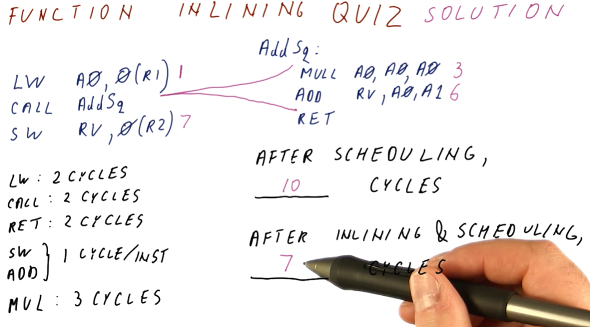

# Function Call Inlining

In **Function Call Inlining**, the compiler identifies simple functions that can
be inlined into the rest of the program code. The example below shows a simple
function that executes one instruction and then returns. This function is
wasteful each time it calls because we have to setup its arguments, call, and
then return - it's unnecessary overhead.

**Function Call Inlining** eliminates call and return overheads because the
code is in the same location. This also allows us to leverage instruction
scheduling because the code is no longer segregated due to function semantics.
We are able to leverage this combination of performance enhancing measures to
gain a shorter execution time.

## Function Call Inlining Downsides

**Function Call Inlining** is subject to code bloat, just like loop unrolling.
In the example provided below, we have a function that is comprised of 10
instructions. If the function is inlined for each instance it is called, we
would end up repeating the same 10 instructions in the program a bunch of times.
We can see how the program code might increase by a large amount if we inlined
a function that was called a lot of times.

We have to be judicious about which functions are inlined. They need to contain
small amounts of code, and it probably makes sense to ensure they aren't called
often.

## Function call inlining quiz

Below is a quiz from the lectures. In this quiz, we compare the number of cycles
it takes to execute a block of code, with and without function call inlining.
In this example, there's no real way we can conduct instruction scheduling due
to the dependencies of the instructions, however, we increase our performance
and execute less cycles when function call inlining is implemented because
we avoid executing the `CALL` and `RET` instructions.

