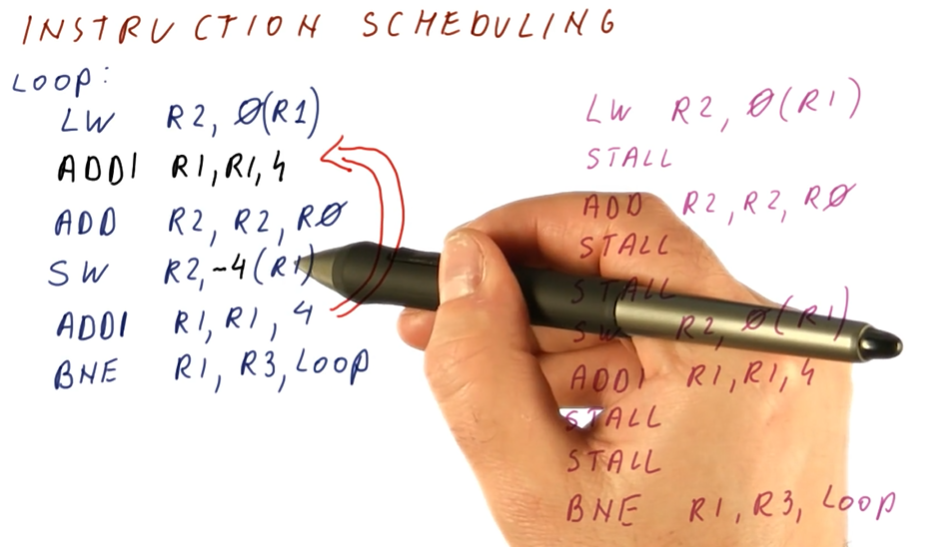
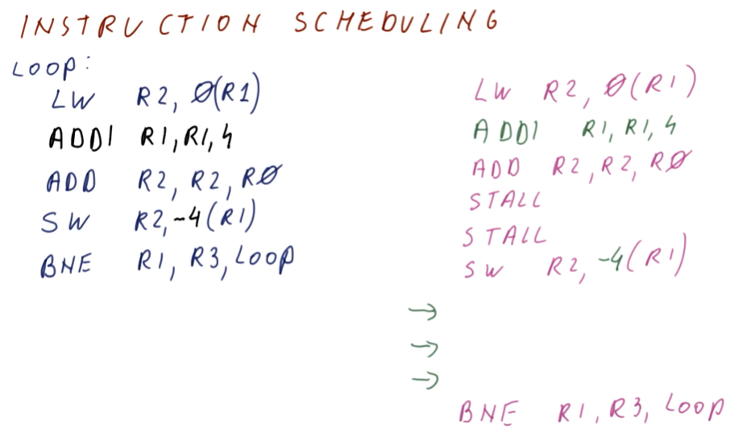
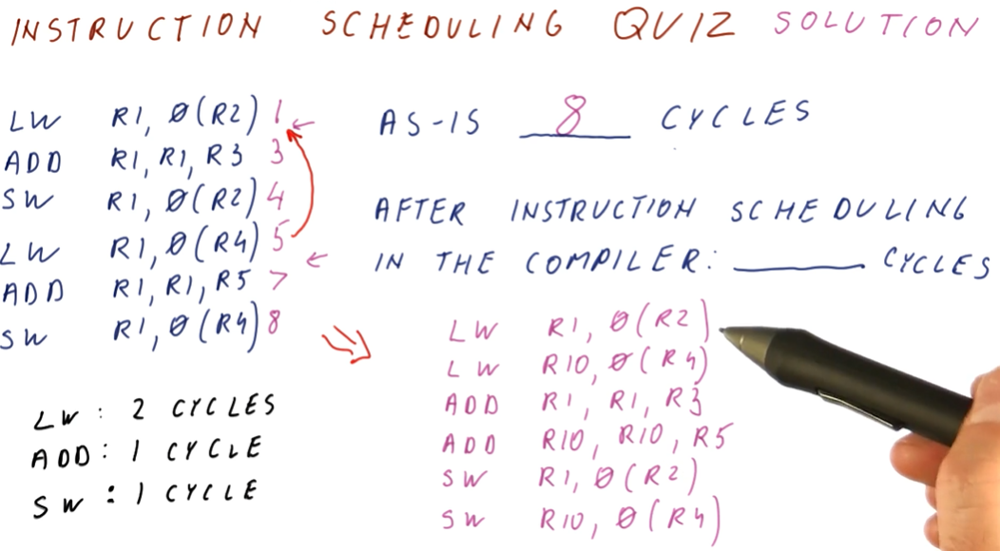
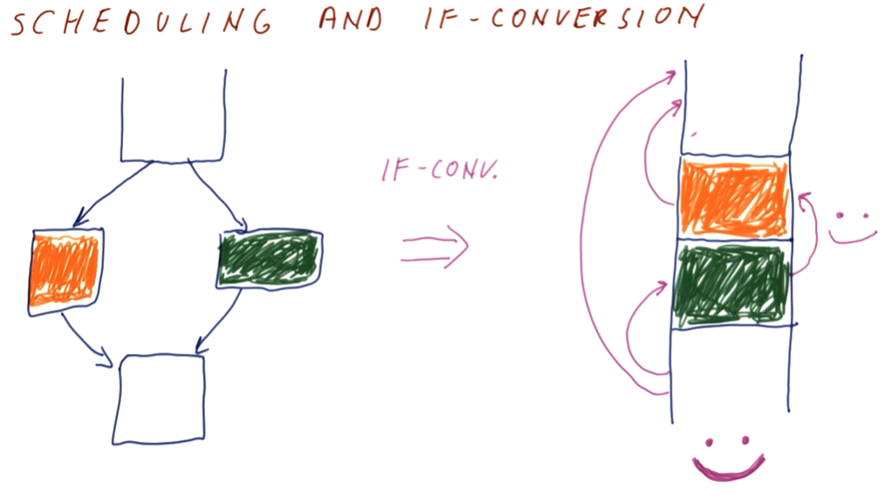
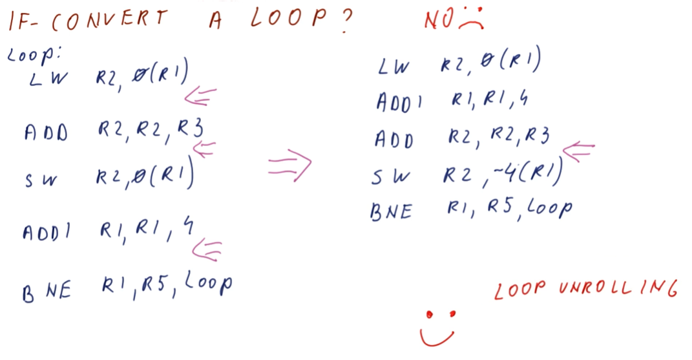

# Instruction Scheduling

The idea behind instruction scheduling is to identify instructions that will
take a couple of cycles to complete and moving instructions that take less
cycles to complete to "stall" locations in the program. This way, we can
execute non-dependent instructions while waiting for something else to happen,
like a read from memory.

The excerpts below provide a high-level representation of a how a compiler
identifies stalls in the program code for long operations and rearranges
instructions to leverage as much concurrency as possible.

## Instruction Scheduling Quiz

The quiz below showcases how we can use instruction scheduling to decrease the
number of cycles it takes to complete a series of instructions. Without
instruction scheduling, it takes us 8 cycles to complete the series of
instructions. Once we identify the stalls, we see that we can execute the
second `LOAD` operation right after the first one *if* we rename the target
register from `R1` to `R10`.

With instruction scheduling, we are able to execute the example instructions in
6 cycles.

## Instruction scheduling and If conversion

We can easily apply instruction scheduling to the blocks of code in different
branches, but how do use instruction scheduling across blocks of code in
different branches? If we conduct instruction scheduling without predication,
we would move some instructions in to different branches, however, if that
branch does not execute, the re-scheduled instruction does not get executed,
changing the behavior of the program.

To solve this, we can combine the branches using
[predication](../../lesson5/predication.md). We prepend the code of if-else
statements with predicates, combine the branches into one block, and execute all
instructions. Then we apply instruction scheduling to increase our efficiency.

Below is a high level representation of this concept.

## Loops and If conversion

So, can we conduct instruction scheduling on loops, using If conversion and
predication to enable the movement of instructions in the program? Yes,
instruction scheduling can be done on the block of instructions that comprises a
loop, however, in order to remove the branch instruction to conduct If
conversion, we would have to install predicates for each loop of the branch.
Is this feasible? Absolutely not - what if we had a branch that looped a million
times, would we install a million predicates?

Below is an excerpt from the lecture explaining this issue at a higher level.

