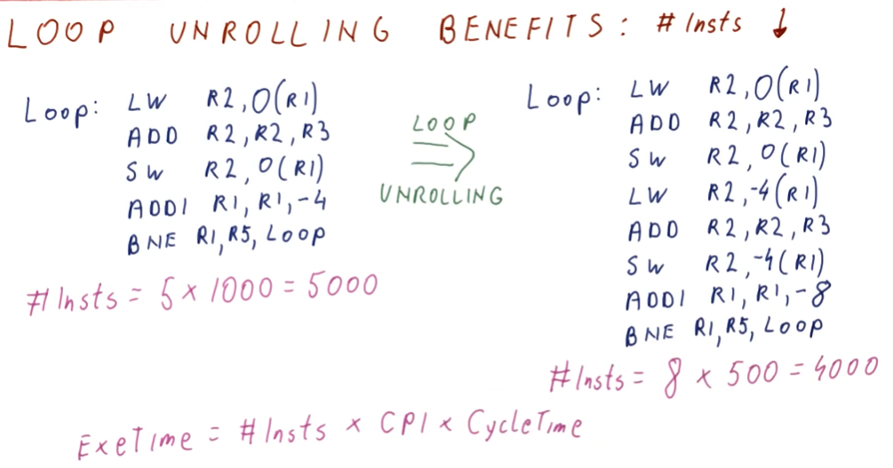
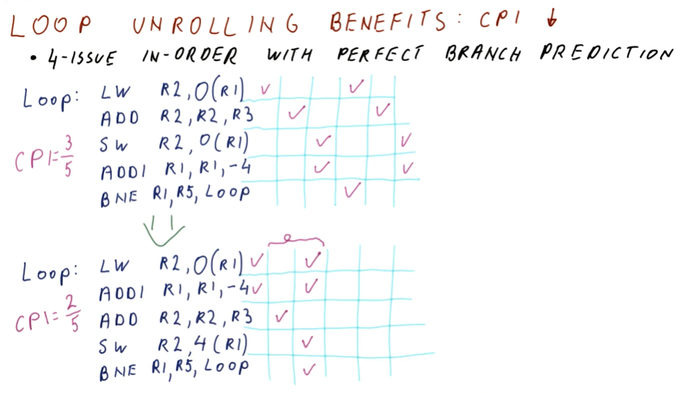
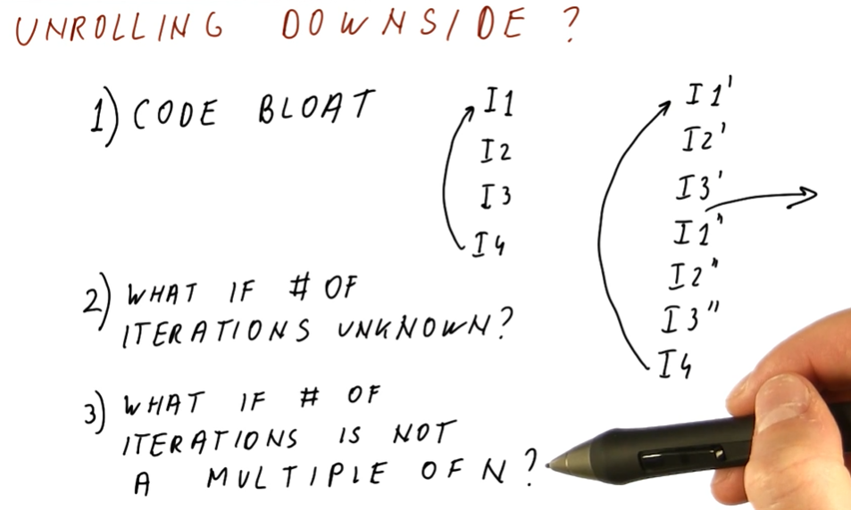

# Loop Unrolling

So how do we get better performance out of loops? Well, we do more work per
loop iteration. In **Loop Unrolling**, the compiler identifies what work is done
each loop and sees if it can execute more instructions per loop iteration. In
the example provided below, the program adds a number to each element in an
array. With **Loop Unrolling**, the compiler unrolls the loop once and executes
the addition of the variable to the next array item in the loop. The loop
iterator is also decremented by 2 instead of 1 to compensate for these changes.

## Loop unrolling benefits: Instructions

**Loop Unrolling** provides us a benefit - we can do less instructions per loop
evaluation! In the example below, we compare two loops, with one being the
unrolled loop.

When evaluation the unrolled loop, we actually execute less instructions because
we execute the last two instructions, `ADD` and `BNE`, less times! These
instructions are what's known as the **loop overhead**.

## Loop unrolling benefits: CPI

Below is the breakdown of CPI for a branch before and after instruction
scheduling is applied. Re-scheduling the instructions, we see that we can avoid
waiting unnecessary cycles for an operation to complete when other operations
that aren't dependent on previous instructions can be dispatched.

The excerpt from the lectures below now does a comparison of the example loop
above, however, we have unrolled the loop once. The unrolled loop without
instruction scheduling doesn't see much of a performance increase. Yes, we
execute less instructions because we've unrolled the loop, however, because
the instructions aren't scheduled we have to wait a couple of cycles for
dependencies to be resolved.

Contrast this with the unrolled, re-scheduled loop. We use another register,
`R10`, to hold the contents of the next item in the loop at `R1 - 4`. We also
re-schedule the add instructions because they are only dependent upon the loads.
The add instruction from the **loop overhead** can also be conducted in parallel
because it has no dependencies. Finally, our `STORE` instructions are edited to
compensate for the changes made to `R1`.

Because of this, we can see that our CPI decreases greatly and we are able to
leverage parallelism.

## Unrolling downsides

Below is an excerpt from the lectures containing a high-level representation of
the downsides to loop unrolling. Here's a breakdown:

* **code bloat** - depending on how many times we unroll the loop, we can bloat
the size of the code in the program.
* **unknown number of iterations** - what if we don't know the number of
iterations? How would would be able to effectively unroll a loop? With an
unknown number of iterations, we could exit the loop early and not execute the
rest of the unrolled loop - which is an issue.
* **number of iterations if not a multiple of N** - what if we're doing an odd
number of iterations and we didn't unroll the loop to fit this? We need to
exit the loop early without executing the rest of the unrolled loop - how do we
make that happen?

