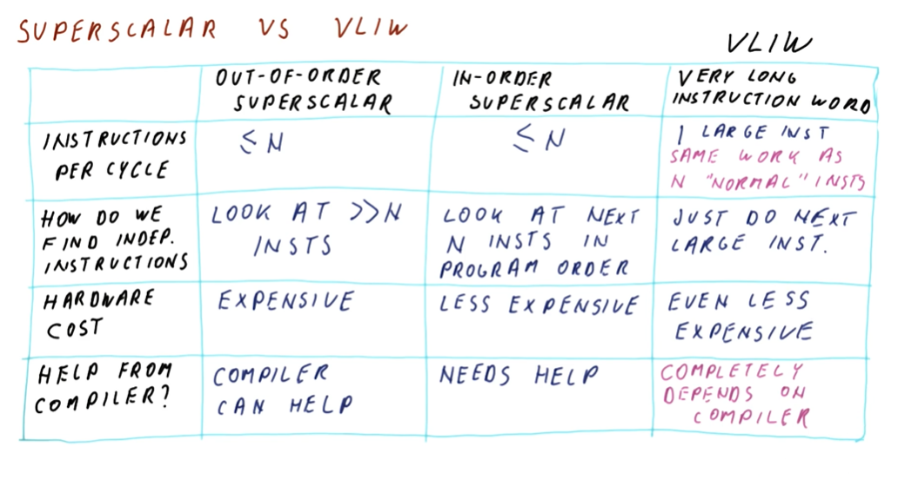
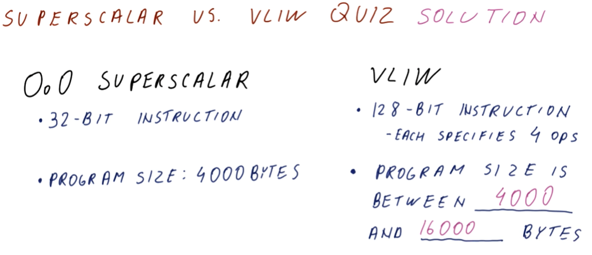
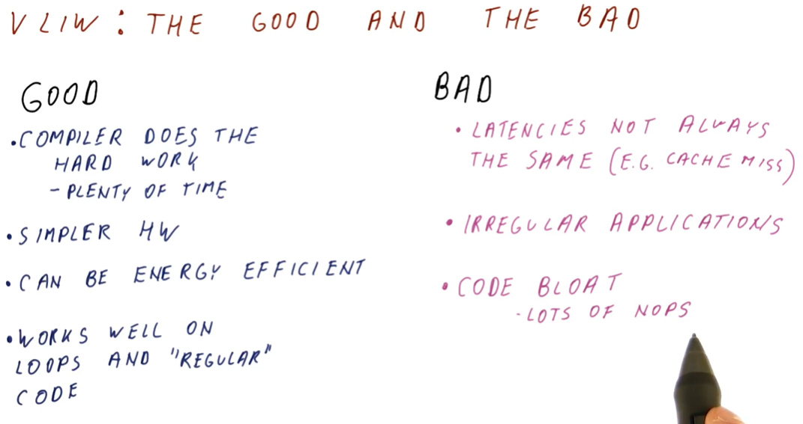
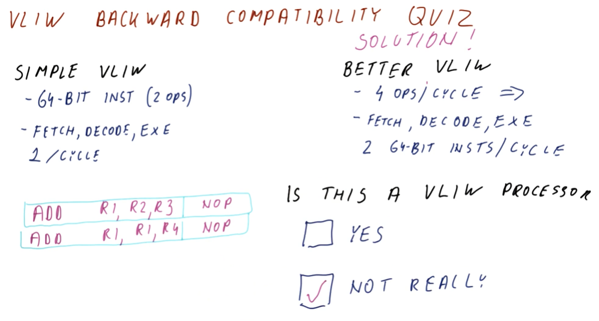
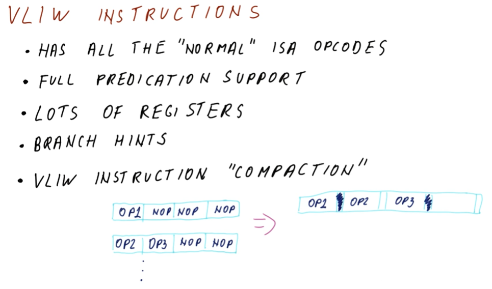
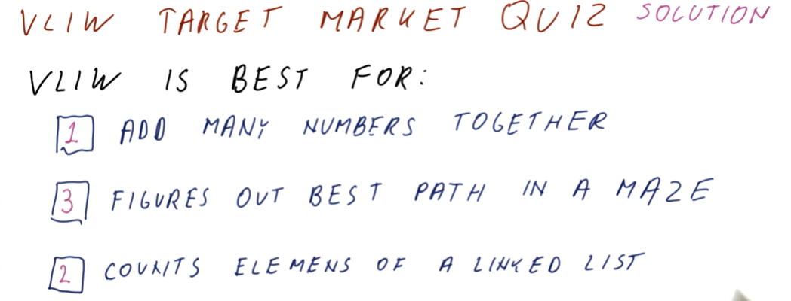

# VLIW

This lesson covers VLIW and explicitly parallel processors. These processors do
not try to identify ILP on their own, instead doing what the compiler instructs
them to do.

## Superscalar vs VLIW

Below is an excerpt from the lectures describing the differences between
out-of-order and in-order superscalar processors and very long instruction word
(VLIW) processors.

## Superscalar vs VLIW quiz

Below is a quiz from lectures comparing the possible program size between a
out-of-order superscalar processor and a VLIW processor. If each 128-bit
instruction for a VLIW processor has no dependencies and can execute all four
operations at once, our programs can be equivalent. If we have dependent
instructions, however, there's a worst-case possibility our 128-bit instructions
would include `NOP`s for 3/4 operations. This would quadruple the program size.

## VLIW: the good and the bad

Below is an excerpt from the lectures providing a high-level description of the
pros and cons of VLIW processors. A quick breakdown of what's not covered in the
image below:

* **Compiler does the hard work** - plenty of time. The basic discussion around
this is that the compiler has more time to schedule instructions, and the
program will be run many times afterwards. This is in contrast to superscalar
processors that must schedule instructions during runtime.
* **Latencies not always the same** - this is talking about how the compiler
won't be able to predict how much latency will be present when the code executes
on different hardware. Cache misses might take longer in different environments.
* **Irregular applications** - it's difficult for a compiler to schedule and
predict the semantics of an irregular program. Things that leverage machine
learning, etc. are in this group.

## VLIW backwards compatibility quiz

Below is quiz about VLIW backwards compatibility. In this instance, the new
compiler is not a VLIW processor. Why? With VLIW, the compiler guarantees that
an instruction contains multiple independent operations. If we increase the
number of instructions executed per cycle, we cannot guarantee that dependencies
will not exist between the two instructions being executed - the compiler did
not account for this and we're breaking the contract, anyways.

In order to run a program on this new VLIW processor, we need to re-compile the
code so that the compiler can re-schedule the instructions and resolve
dependencies.

## VLIW instructions

Below is an excerpt from the lecture, describing the the characteristics of
VLIW instructions.

## VLIW target market

Below is quiz from the lectures asking us to rank the best application for VLIW
processors.

