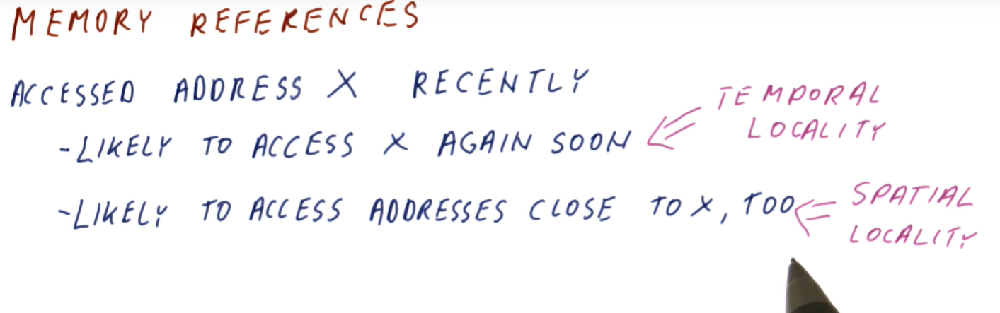
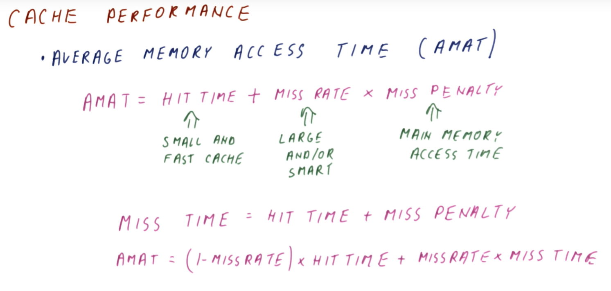
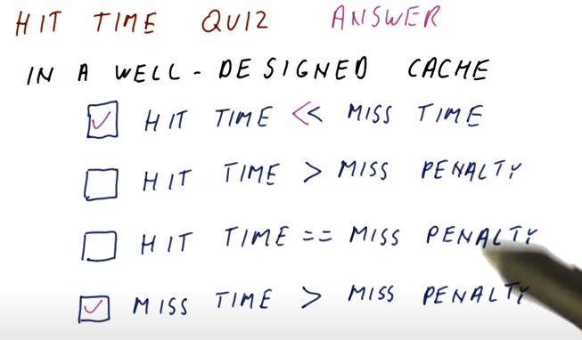
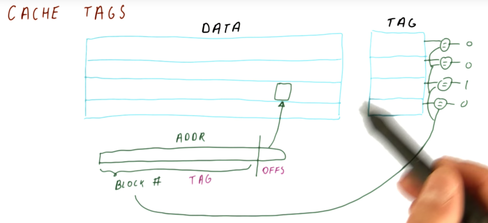
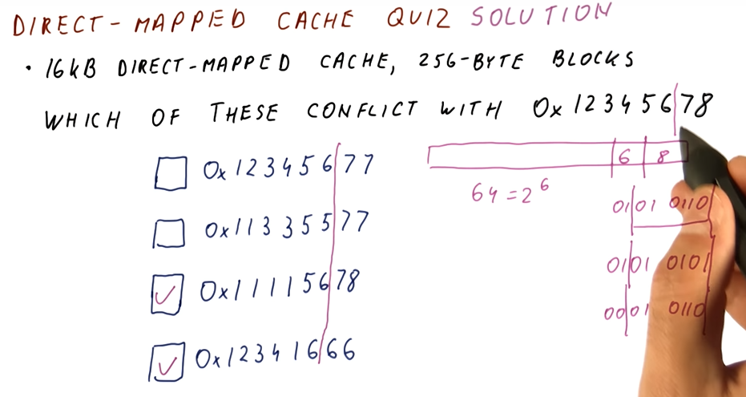
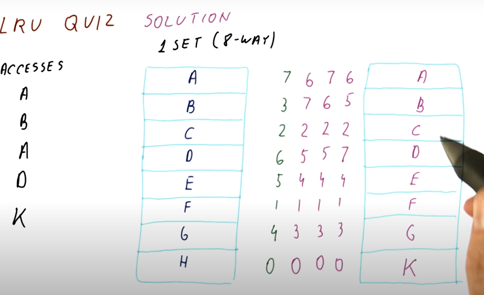
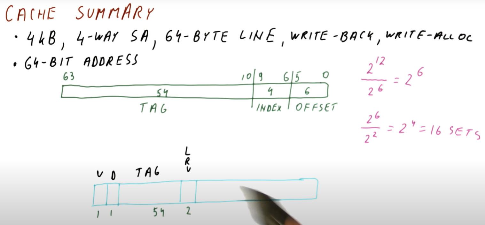

# Cache

This section conducts a review of the hardware cache. The notes for this lesson
can be found [here](./pdf/Lesson12Notes.pdf)

## Locality

Below is a high-level description from the class describing the concept of
locality.

The below image from the lectures describes the concepts of
**temporal locality** and **spatial locality**.

## Temporal Locality Quiz

The below quiz from the lectures discusses temporal locality with an example
section of code. The `j` and `sum` variables are accessed very often, having
temporal locality in the cache.

## Spatial Locality Quiz

We are likely to access all elements of the array in this loop, thus `arr` has
spatial locality.

## Cache Quiz

The quiz below describes the concept and purpose of a processor cache.

## Cache Performance

The below excerpt from the class describes the metrics used to measure cache
performance.

## Hit Time Quiz

This quiz asks some common-sense questions about the timing for a well-designed
cache.

## Miss Rate Quiz

This quiz asks common-sense questions on the comparison between hit rate and
miss rate.

## Block Size Quiz

The below quiz covers good use of the cache for variables with specific
behaviors.

## Block Number Quiz

The below quiz shows us how to calculate the block number.

## Cache Tags

The below excerpt from the class describes cache tags.

## Valid Bit

The below excerpt from the class describes the valid bit.

## Direct Mapped Cache

The below excerpt from the class describes the direct mapped cache structure.

## Direct Mapped Cache Quiz

The below quiz demonstrates how to find cache conflicts in direct-mapped caches.

## Direct Mapped Cache Quiz

Another direct mapped cache quiz showcasing cache conflicts.

## Associative Cache Quiz

The below quiz showcases how we index into an N-way associative cache with an
address.

## Implementing LRU

The below excerpt from the class describes how the LRU policy is implemented for
cache line replacement.

## LRU Quiz

The below quiz demonstrates the LRU cache replacement policy.

## Write Policy

The below excerpt from the lecture provides a good discussion of the differences
between cache writing policies.

## Cache Summary

The below excerpt from the course summarizes the data used to handle an example
cache, demonstrating how the cache structure influences the data used to track
the tags, indices, etc.

## Cache Summary Quiz

Below are the answers to the cache summary quizzes that tie all of these
concepts together.

