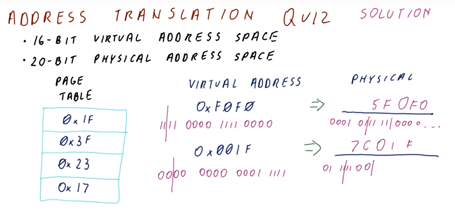
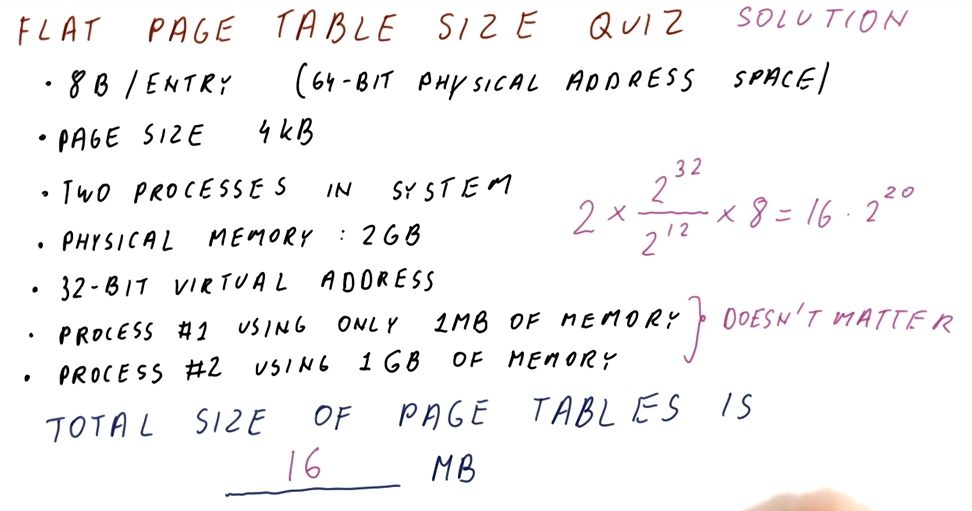
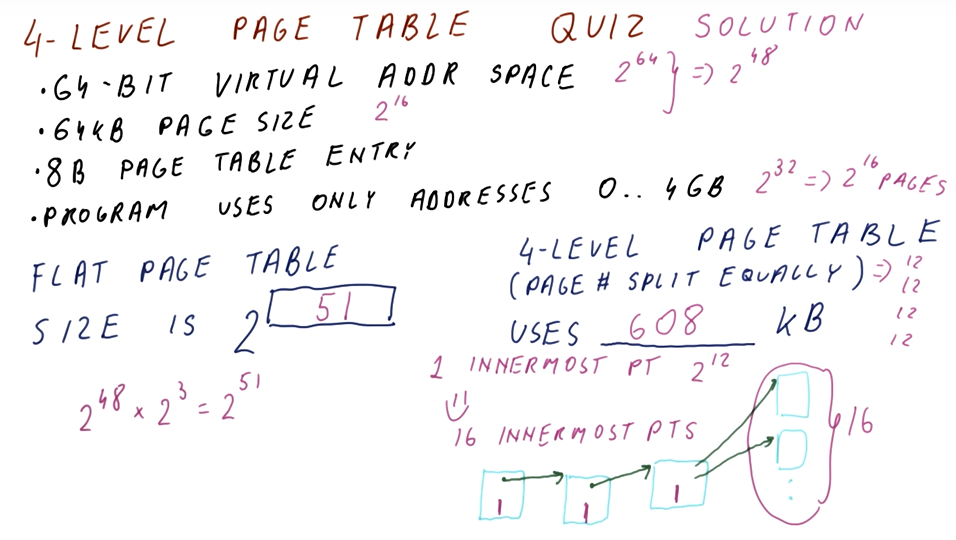
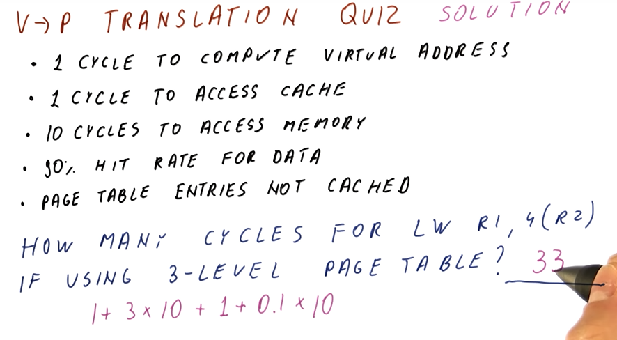
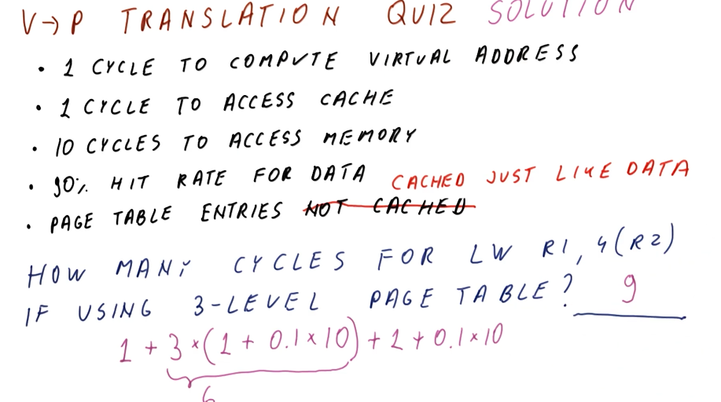

# Virtual Memory

This lesson discusses the difference between virtual and physical memory.
Virtual memory is used by programs and must be translated to physical memory.
Since the translation can be slow, a Translation Look­Aside Buffer (TLB) is used.
The notes for this lesson can be found [here](./pdf/Lesson13Notes.pdf).

## Page Size Quiz

Below is a quiz from the lectures that has us calculate the number of physical
memory frames for a system and then the number of page table entries for each
process.

## Address Translation Quiz

Below is a quiz from the lectures that demonstrates how to conduct address
translation.

## Flat Page Table Size Quiz

Below is a quiz from the lectures that demonstrates how to calculate the size
of flat page tables for multiple architectures.

## Two Level Page Table Size

The below excerpt from the course describes how we can save memory using multi
level page tables.

## 4 Level Page Table Quiz

The below quiz from the lectures demonstrates how to calculate the amount of
memory needed for a page table with 4 levels.

## Virtual to Physical Translation Quiz

The below quiz from the lectures demonstrates how to calculate the number of
cycles necessary necessary to conduct virtual to physical address translation.

The below quiz from the lectures demonstrates the same as above except the page
table entries are cached.

## TLB Size Quiz

Below is a quiz from the lectures covering how we can calculate the approx.
size of the TLB to achieve similar performance to the cache.

## TLB Performance Quiz

Below is quiz demonstrating how to calculate TLB performance for a given set of
memory accesses by a program.

