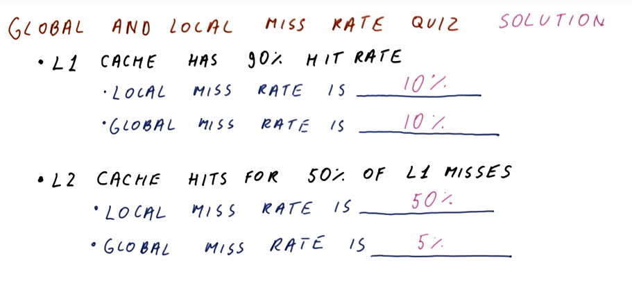

# Advanced Caches

Improving the performance of caches is done by improving the hit rate, improving
the miss rate, or improving the miss penalty. The methods to implement these
improvements in discussed in this lesson. The notes for this lecture can be
found [here](./pdf/Lesson14Notes.pdf).

## VIPT Aliasing Avoidance Quiz

Below is a quiz from the class demonstrating how to calculate the maximum size
of a VIPT cache while avoiding aliasing.

## NMRU Quiz

Below is a quiz demonstrating how we can keep track of the hit/misses for an
NMRU cache.

## Prefetch Instructions Quiz

Below is a quiz demonstrating how we can calculate how far ahead and whether or
not a prefetch should be conducted.

## Global and Local Miss Rate Quiz

Below is a quiz demonstrating how to calculate the local and global miss rates
for two caches.

