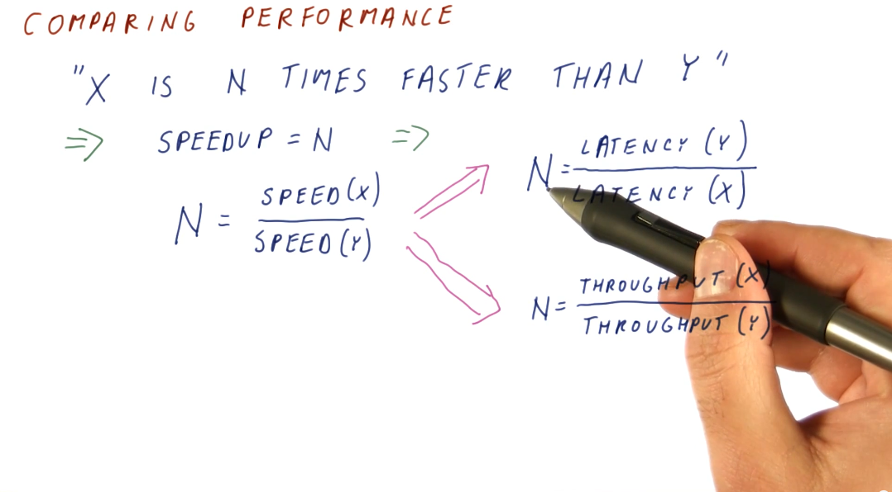
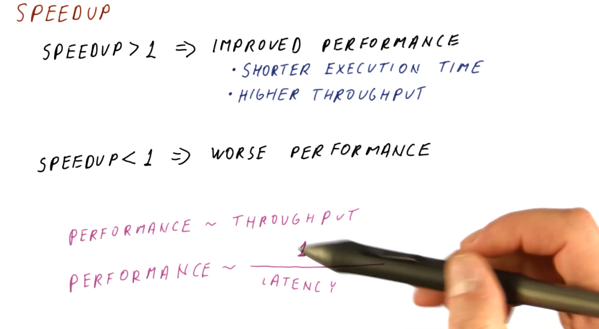
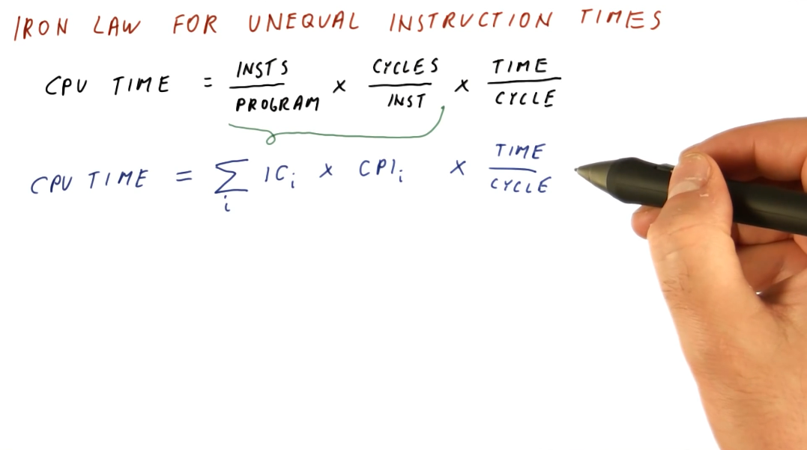

# Metrics and Evaluation

This lesson covers latency and throughput, two metrics used to measure computer
performance.

## Performance

* **Latency** - the total time it takes for an operation to complete, from start
to finish.
* **Throughput** - *not the inverse of latency*; because operations can take
place concurrently within a pipeline, this can be thought of as the number of
operations completed per unit measure of time.

Below is a high-level representation of this concept.

## Comparing performance

Knowing how to measure performance, we can now compare the performance of two
systems using our metrics. We want to be able to make a definitive statement
about the **speedup** of a system in comparison to another system, basically
stating that system **x** is faster than system **y**. We can compute this with
both **latency** and **throughput**, however, our equations are slightly
different. Below is an image showing us the equations for computing **speedup**
using our two metrics.

## Speedup

A **speedup** value larger than 1 means we have improved performance. With
improved performance, we achieve higher throughput and shorter execution time. A
speedup less than 1 means that we have worse performance. When computing
speedup, we need to remember that performance is directly proportional to
throughput and performance has an inverse relationship with latency.

## Measuring performance

What workload do we use to measure performance of different systems? We can't
use an actual user workload because:
* Many different users use computers in many different ways with many different
programs.
*  One workload will not be representative of all users.
*  How are we supposed to acquire the workload data?

In order to solve this issue, we use **benchmark** workloads.

## Benchmarks

Benchmarks are programs and input data that users and organizations have agreed
upon for use in performance measurements. Usually, we don't have just one
benchmark program but a **benchmark suite** consisting of multiple programs and
input data. Each program within a benchmark suite is representative of a type
of application.

## Types of benchmarks

So what types of benchmarks are commonly used to measure performance? We have:

* **Real applications**
  * Most representative of real workloads.
  * Also the most difficult to setup on new machines. Our testing environment
likely doesn't have an operating system, hardware, graphics processors, etc.

* **Kernels**
  * The most time consuming portions of an application, usually a loop of some
sort. We've isolated these processing intensive sections of code to test our
machine. *Usually good for testing prototypes.*

* **Synthetic benchmarks**
  * Behave similar to kernels but are simpler to compile. We utilize these
benchmarks when testing early prototypes of a machine. *Usually good for design*
*studies.*

* **Peak performance**
  * Performance that's not based on running against actual code. The theoretical
highest number of instructions per second. *Usually good for marketing.*

## Benchmark standard

So how are benchmark suites created? Who makes them and what are the standards?
There exist standards organizations that receive input from manufacturers, user
groups, and experts in academia and these organizations produce standard
benchmark suites. Some well known standard benchmark suites are:

* **TPC** - Benchmarks used for databases, web servers, data mining, and other
transaction processing. [[1]](#references)
* **EEMBC** - Used for embedded processing. [[2]](#preferences)
* **SPEC** - Used to evaluate engineering work stations and raw processors. SPEC
encompasses a large set of workloads, trying to cover a variety of uses for
processors in high performance systems. A breakdown of these workloads is in the
image below. [[3]](#preferences)

## Summarizing performance

To summarize performance, we are looking for the **average execution time**.
A demonstration on how to calculate this is shown below. We should refrain from
averaging the speedups for each application tested - averaging ratios will not
provide useable data to summarize performance. In order to acquire the average
speedup, we need to use the **geometric mean** for the execution times of each
computer.

## Iron Law of performance

Processor time (CPU time) can be expressed as:
`(instructions/program) * (cycles/instruction) * (seconds/cycles)`

So why do we think about these components of processor time instead of just
measuring processor time directly? These three components allow us to think
about the different aspects of computer architecture.

* `(instructions/program)` - influenced by the algorithm used to create the
program, the compiler used to interpret and generate the program, and the
instruction set being used.
* `(cycles/instruction)` - influenced by the instruction set being used, and
the processor design.
* `(seconds/cycle)` - influenced by the processor design, circuit design, and
transistor physics.

Computer architecture primarily focuses on instruction set and processor design,
and good designs of these two aspects attempts to balance their effects on
CPU time.

## Iron Law for unequal instruction times

It's pretty simple to calculate CPU times when we assume that all instructions
for a program will take the same amount of cycles to execute. This isn't always
the case, however. We need to be able to sum all the cycles for each type of
instruction before we multiply this with our time per cycle. Below is a
representation of this concept, showing us how to calculate a more realistic
CPU time.

Below is an example problem in which we calculate the sum of cycles for a
program in order to determine the CPU time.

## Amdahl's Law

This law is useful when we need to calculate the overall speedup of the entire
program, but we only enhanced a fraction of the program. Below is an image
that attempts to explain the equation for Amdahl's Law, a description of each
variable in the equation is provided:
* `(1 - frac_enh)` - the fraction of the program that wasn't enhanced.
* `frac_enh` - the fraction of the program that was enhanced.
* `speedup_enh` - the speedup achieved due to the enhancement.

It's very important to understand that `frac_enh` is a percentage of the
original execution time that is affected by the enhancement.

### Implications

It's important to aim for enhancements that achieve a speedup on a larger
percentage of execution time for a program. This is demonstrated mathematically
below.

Below is an example of how to use Amdahl's Law to compare multiple possible
improvements.

## Lhadma's Law

This law is jokingly used to express the opposite of Amdahl's Law. While
Amdahl's Law says to optimize for the common case, Lhadma's warns us that we
should avoid attempting to optimize too much at the expense of other parts of
our performance. An example is provided below.

## Diminishing returns

This concept covers the idea that as computer architects, we need to
continuously review what needs to be enhanced within a system instead of
continuously enhancing the same portion of a system. This concept stems from
Amdahl's Law, as it describes that, eventually, the enhanced portion of a
system will become smaller as we apply enhancements across generations. We will
achieve a diminished speedup if we continue to enhance the same portion of the
system. We need to continually reassess what is the common case when conducting
our enhancements. Below is a high level representation of this idea.

## References

1. [http://www.tpc.org/tpch/](http://www.tpc.org/tpch/)
2. [https://www.eembc.org/](https://www.eembc.org/)
3. [https://www.spec.org/benchmarks.html](https://www.spec.org/benchmarks.html)
4. [Lesson 2 Notes](./pdf/Lesson2Notes.pdf)