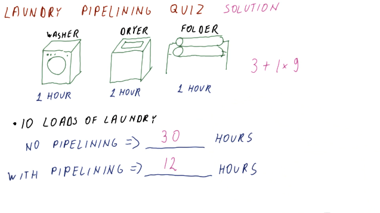
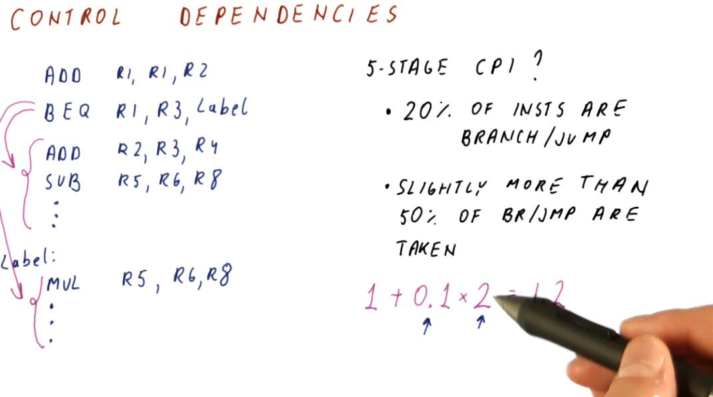
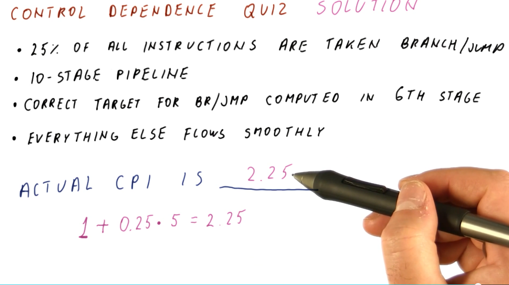
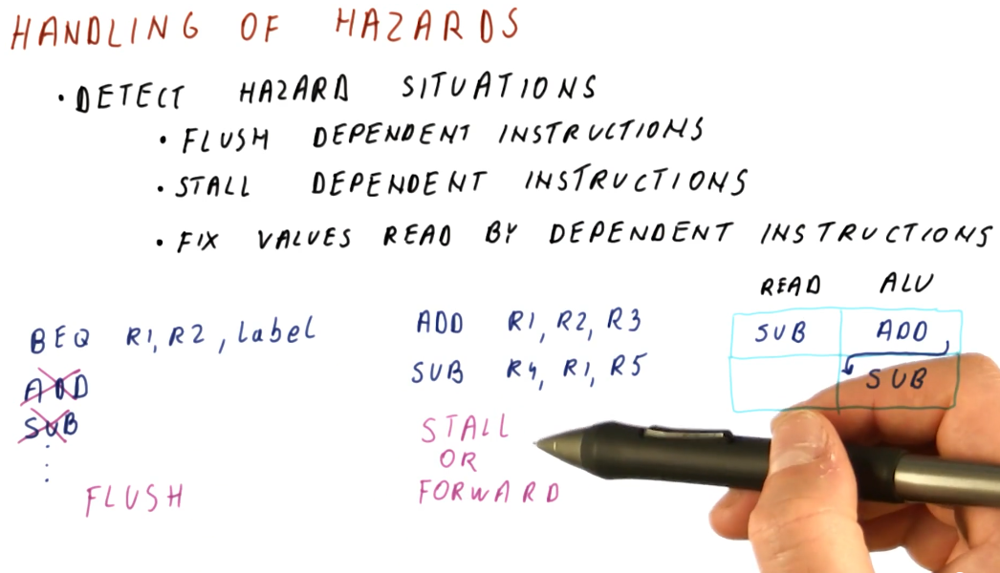

# Pipelining

This lesson reviews pipelining to set the stage for more advanced topics.

## Pipelining in a processor

This section covers basic pipelining in a processor. Most processors are much
more complex than the example provided here, however, this is used to review
content for students.

In a traditional processor pipeline, we have are series of stages. The following
listing of stages is not *all* stages, but it encompasses the important ones:
* **fetch**
* **read**
* **decode**
* **execute**
* **memory access**
* **write**

So how does pipelining apply to these stages? Instead of fetching, decoding, and
executing one instruction at a time, while one instruction is being decoded,
another instruction can be fetched from instruction memory. Then, when one
instruction is being executed, we can be decoding the instruction behind it.
So, while the latency may not change, the throughput of instructions through
the pipeline increases. Below is a high level representation of this concept:

Below is an example of calculating the latency of process with and without a
pipeline.

Below is a similar example as the one above, however, this one applies to
instructions and cycles.

## Pipeline cycles per instruction

Throughout these notes we've been assuming one cycle per instruction, or a CPI
of 1, when our pipeline is full. In the real-world, however, we'll have billions
of instructions to execute - will our CPI always be 1? Here are some reasons
why our CPI might not be 1:

* **initial fill** - when the pipeline initially fills up, our CPI will not be
equal to 1. Regardless, as our instruction number reaches infinity, CPI will
begin to approach 1.
* **pipeline stalls** - there exists the possibility that a fault occurs in the
pipeline and an instruction stalls, causing it to have to remain at that stage
for a cycle.

Below is a high-level representation of how a CPI can be greater than 1.

## Processor pipeline stalls

A processor pipeline stall usually occurs when some instructions depend upon the
outcome of previous instructions that conduct a read/write. In the example
below, the program loads a value into a register, increments the register, and
then stores that value into a different register. The load operation must occur
before the increment and load instruction, otherwise the increment instruction
will be incrementing an incorrect value. Because of this dependency, a processor
pipeline stall occurs, and a **bubble** in the pipeline is created. The
increment instruction must wait two cycles until the memory is read and written
into the register that is to be incremented.

This phenomenon causes our CPI to be greater than 1.

## Processor pipeline stalls and flushes

A processor pipeline flush occurs when the processor pipeline fetches and
decodes instructions that aren't actually supposed to be executed, so they're
removed from the pipeline and replaced with bubbles. Below is an example
demonstrating what happens when a `JMP` instruction is introduced into the
pipeline. Some instructions behind the `JMP` are fetched and decoded, however,
they are fetched from an incorrect location in memory. After the `ALU`
determines the destination of the `JMP`, instructions from the `JMP` destination
are fetched and decoded, and the instructions that weren't destined to be
executed are flushed from the pipeline.

This is another phenomenon that could cause the CPI to be larger than 1.

## Control dependencies

The problems described in the previous sections that cause these processor
pipeline stalls are called **control dependencies**. The example provided below
provides a high-level representation of a control dependency. In the scenario,
a branch instruction will jump to some **label** in code, however, to sections
of code depend upon the branch: the code directly after the branch and the code
contained at the label.

This example also shows us how to predict the CPI based upon this concept of
control dependencies. Given a percentage of instructions are branches, given
that a percentages of branches are actually taken, and given that we know that
the fetching and decoding of control dependencies causes at least two bubbles in
the pipeline, we can calculate the increase in CPI from its normal value of 1.

In later discussions, we will cover a concept called **branch prediction** that
is designed to mitigate the occurrence of these bubbles within the pipeline by
predicting where a branch will land in order to fetch and decode the correct
instructions. Control dependencies can cause even more bubbles to form in a
pipeline if the pipeline contains more than 5 stages, so these issues definitely
need to be mitigated to increase performance and normalize the CPI.

Below is an example question from the lectures that asks us to determine the CPI
given a percentage of branches/jumps taken and when the branches/jumps are
computed in the pipeline.

## Data dependencies

Briefly described in [this](#processor-pipeline-stalls) section,
**data dependencies** occur when one instruction depends upon the outcome of
another instruction. TODO types of dependencies exist:

* **read after write (RAW)** - type of dependency in which one instruction
relies upon the previous instruction writing some data that will be used by the
dependent instruction. This type of dependency is also called a **flow**
dependence because the data flows from one instruction to the other. This type
of dependency is also called a **true** dependency because the value being used
by the dependent instruction doesn't exist until the previous instruction
writes.
* **write after write (WAW)** - type of dependency in which the order of write
operations needs to be preserved. The example provided uses registers, in which
a specific value is expected to be within `R1` for future instructions. These
writes will not be able to to be conducted out of order - they both write to
the same location. This type of dependency is also called an **output**
dependency.
* **write after read (WAR)** - type of dependency in which a previous
instruction needs to read some data, but a future instruction intends to write
to that data. These instructions can not be interleaved, the previous
instruction expects the data to be unchanged upon read. The read will take place
before the write, creating the dependency. This type of dependency is also
called an **anti-dependency** because it reversed the **RAW** dependency.

The **WAW** and **WAR** dependencies are called  **false** or **named**
dependencies. **Read after read (RAR)** is not a dependency.

Below is an example from the lectures inspecting a series of instructions to
determine what data dependencies exist.

## Data dependencies and hazards

A **hazard** is when a dependence results in incorrect execution of an
instruction. In the example provided below, there are three instructions that
have dependencies but their dependencies will not result in incorrect values
being used for execution.

The `DIV` instruction, however, will be using a **stale** value for `R4` when it
executes and writes to `R10` because, when the `DIV` instruction reaches the
**decode** stage of the pipeline, the `SUB` instruction has not yet written its
value to `R4`.

Hazards can both be a property of the program as well as because of the
pipeline. Another example provided in the image below shows that, in this 5
stage pipeline, true dependencies do not create a hazard when 3 or more
instructions separate the dependent instructions. This is because, by the time
the first instruction in the dependent pair executes and writes, the second
dependent instruction is still being fetched.

Below is an example problem with a 3 stage pipeline, demonstrating how we can
inspect instructions to determine dependencies and hazards.

## Handling of hazards

We need to introduce mechanisms to handle hazards we detect in order to protect
our CPI and performance. We don't care about all dependencies that are
introduced, only the ones we know will cause incorrect execution. These are our
possible mitigation techniques:

* **Flush dependent instructions** - used for control dependencies. We don't
intend to execute instructions introduced into the pipeline by control
dependencies.
* **Stall dependent instructions** - used for data dependencies in order to
prevent instructions from reading invalid values.
* **Fix values read by dependent instructions** - also used for data
dependencies, this introduces the concept of **forwarding**, providing the a
dependent instruction with the value it needs to correctly decode and execute.

Below is a high-level representation of these hazard handling mechanisms.

Below is an example problem with a 5 stage pipeline and a series of instructions
containing multiple dependencies and hazards that must be avoided. This example
demonstrates how we can use the pipeline to determine when it is appropriate to
flush, stall, or forward to handle hazards.

## How many stages?

In the pipelines we've reviewed, the ideal CPI is 1. Later in the course,
pipelines with a CPI higher than 1 are expected because the pipeline is
attempting to execute more than one instruction per cycle. Regardless, each
pipeline setup has an ideal CPI that it attempts to achieve.

So what happens if we add more stages? Well, we get more hazards. If a branch
is resolved in the third cycle of a pipeline, we only have to flush the two
previous instructions that were fetched and decoded. If a branch is resolved
in, for example, the tenth cycle of a pipeline, now 9 instructions have to be
flushed from the pipeline - kinda wasteful. With more hazards, our CPI also
increases.

Inversely, with more stages in our pipeline there's less work being done per
stage, decreasing our cycle time - we can execute cycles faster. Remember the
Iron Law?

`CPU time = #instructions * CPI * cycle_time`

If our number of instructions stays the same, but our CPI increases and our
cycle time decreases, we achieve a balance even with this longer pipeline. We
carefully choose the number of stages in our pipeline to balance the
relationship between CPI and cycle time.

Modern processors achieve the most performance with a processor pipeline of
30 - 40 stages as this strikes a perfect balance between cycle time and CPI.
This is great, but with an increase in number or processor pipeline stages, we
also draw a lot of power because we execute a lot of cycles per second. Thus,
a reasonable number of stages for the processor pipeline of modern processors is
10 - 15 stages as this strikes the best balance between performance and power.

Below is a high-level representation of the concepts described above.

## References

1. [Lesson 3 Notes](./pdf/Lesson3Notes.pdf)