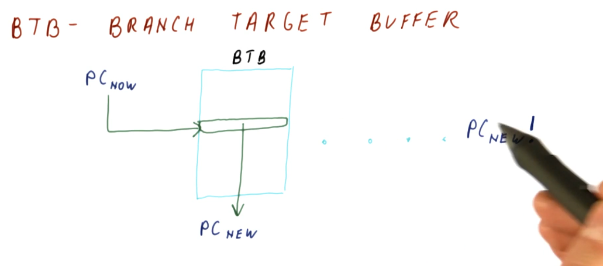
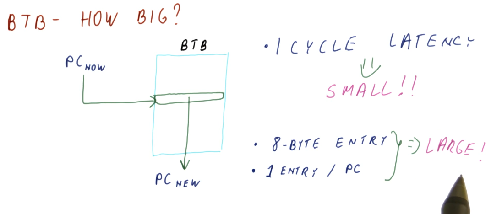

# Branch Target Buffer (BTB)

The simplest predictor that uses history is the **branch target buffer**. So
how does it work? The program counter (PC) is used to index into the BTB.
Stored at this index is the predicted next program counter. The next program
counter is fetched into the pipeline. When the branch is calculated, the real
next program counter is determined and compared against the predicted next
program counter that was fetched. If they're the same, the BTB predicted the
next program counter correctly based upon the historical data saved for the
program counter used as an index. If they're not the same, the BTB predicted
incorrectly and the next program counter is saved to the BTB using the index
program counter.

How big does the BTB need to be to implement the predictor? Well it serves the
purpose of predicting the next instruction based upon the current instruction
in the program counter. So in order to feasibly predict every next instruction,
we need to have an index for every instruction in the program - meaning the
BTB needs to be the same size as the program itself! That's not realistic, let's
see if we can't find another answer.

## Realistic BTB

First, we don't need an entry in the BTB for every single instruction in the
program - we can have the BTB contain only the instructions that are most
likely to be executed next. The BTB will operate somewhat like a cache, using
values that are most recently used. An example provided in the lecture is a
loop that contains, say, 100 instructions. As the loop executes, the BTB fills
with the loop's instructions and the BTB doesn't change for the duration of the
loop.

So how do we avoid program counter index collisions in the BTB? We use a
mapping function that's simple enough to execute within one cycle. In the
example provided, if the BTB contains 1024 entries, we use the last 10 bits of
our 64 bit program counters as indices. Why are we using the LSB of our program
counters? Because as a program increments, these values are what changes when
each instruction is executed.

## BTB Quiz

In the quiz below, we would think that we would just use the last 10 bits of the
program counter, however, because our architecture enforces 4 bytes instructions
that are word-aligned, each entry in the BTB needs to be even and also divisible
by 4. So, in a BTB of 1024 entries, we would only be using 256 of the values -
that's a lot of wasted entries.

Our solution is to ignore the last 2 bits of the program counter and use the 10
bits to the left of these ignored bits - these bits are the ones that are most
likely to change. Using this indexing function, a program counter of
`0x0000ab0c` will be contained at BTB index `0x2c3`.

