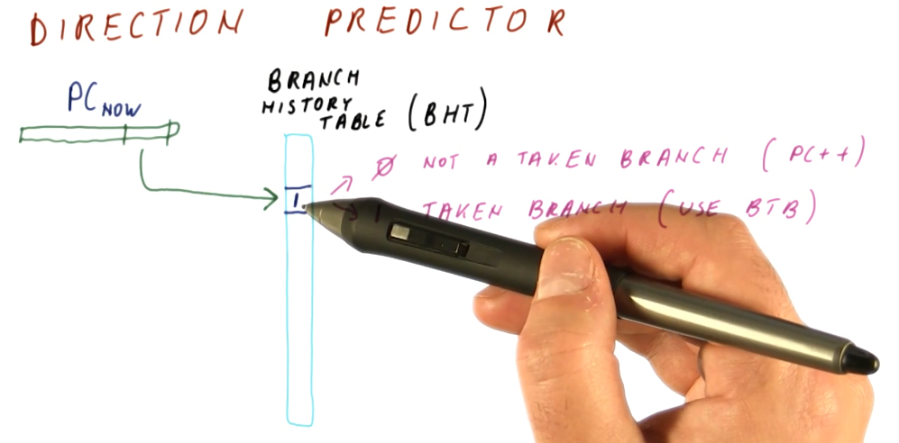
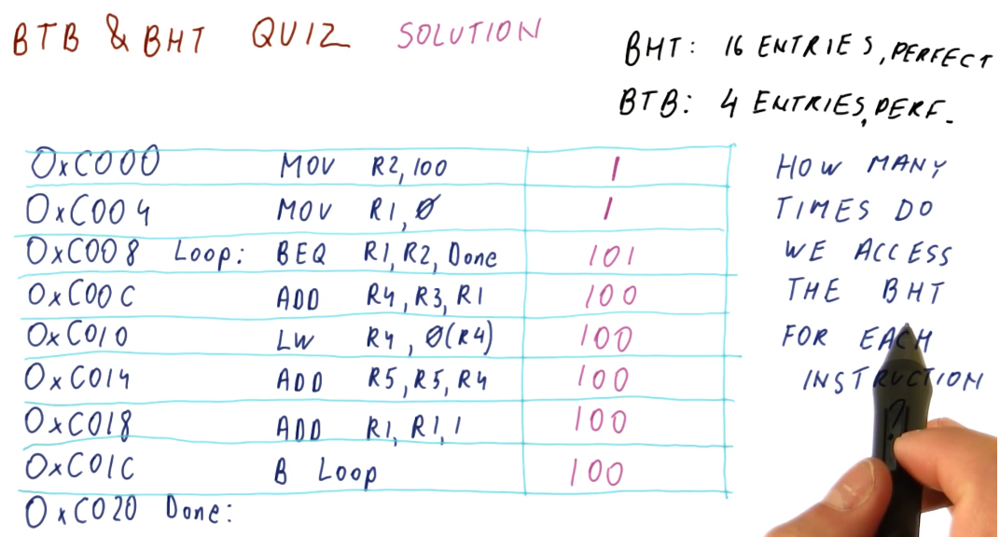
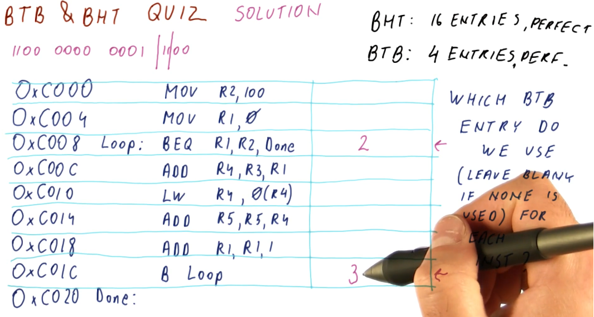
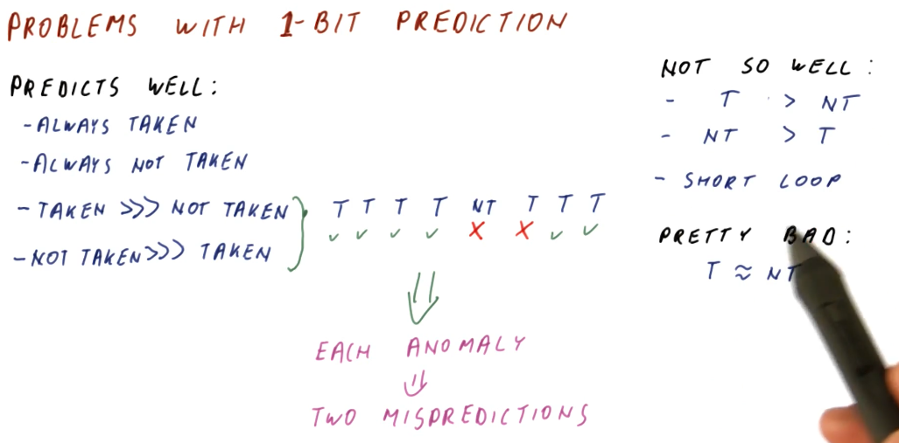

# Direction Predictor

We further simplify our branch predictor by adding another abstraction, the
**branch history table**. This table contains a `1` or `0` for each different
program counter that indexes into it - we calculate indices just like we did
with the BTB (using the LSBits of a program counter that are most likely to be
unique).

The `0` represents that the branch is not taken. The program counter is
incremented and we begin fetching instructions from that location. No changes
are made to the BTB because no branch was taken.

The `1` represents that the branch is taken. The BTB is referenced to determine
the next program counter based upon the current one being inspected, and we
begin to fetch instructions from that new location.

If the prediction made is incorrect, the branch history table is updated with
the correct value at the index - `0` or `1`. If a not taken prediction was made
and this prediction ended up being incorrect, we update the BTB with the next
program counter that is the destination of the branch.

Because the branch history table is only 1 bit for each index, we can have way
more entries for unique program counters. This way, we can use the BTB only for
branches and not just regular instructions.

## BTB & BHT Quiz

The below quiz excerpt demonstrates that the BHT needs to be accessed for each
instruction.

## BTB & BHT Quiz 2

The below quiz excerpt demonstrates how the BHT is indexed using the program
counter.

## BTB & BHT Quiz 3

The below quiz excerpt demonstrates the conditions required to access the BTB.

## BTB & BHT Quiz 4

The below quiz excerpt demonstrates how the BTB is indexed using the program
counter.

## BTB & BHT Quiz 5

The below quiz excerpt demonstrates how we can calculate the number of
mis-predictions for each instruction using an imperfect BHT.

## Problems with 1 bit prediction

So what's wrong with the 1 bit predictor? Why does its performance not satisfy
the needs of computer architecture designers, creating the need to research
pattern predictors?

The 1 bit predictor predicts these things well:

* **Branches that are always taken**
* **Branches that are always not taken**
* **Branches that are taken A LOT more often than not taken**
* **Branches that are not taken A LOT more often than taken**

The example below demonstrates how, when a 1 bit predictor encounters an
**anomaly** in predictions for a particular branch, this can incur two
mis-predictions.

The 1 bit predictor does not perform well when:

* **Branches are taken more often than not, but not by much**
* **Branches are not taken more often than not, but not by much**
* **Encountering short loops**

The 1 bit predictor will be bad when:

* **Branches taken and not taken are about the same in number**

