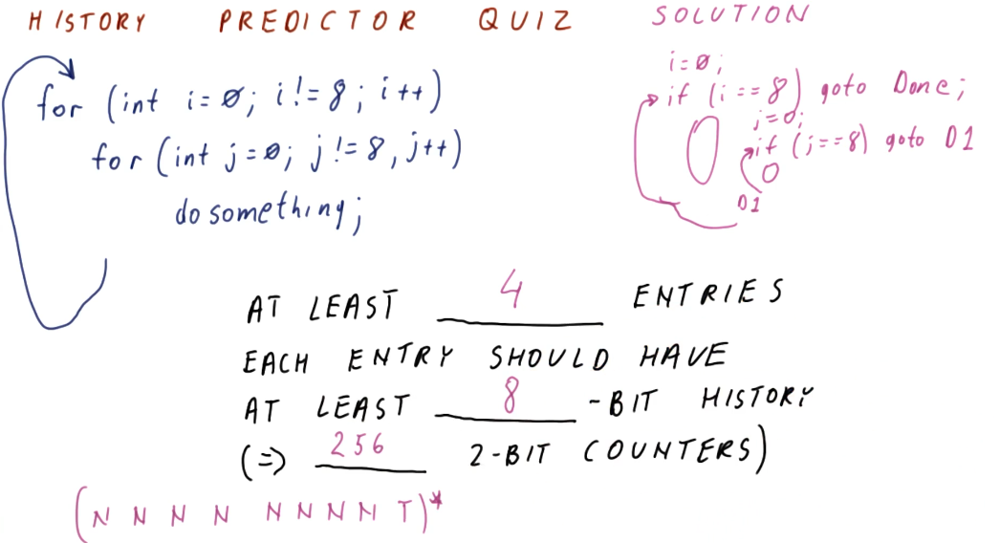
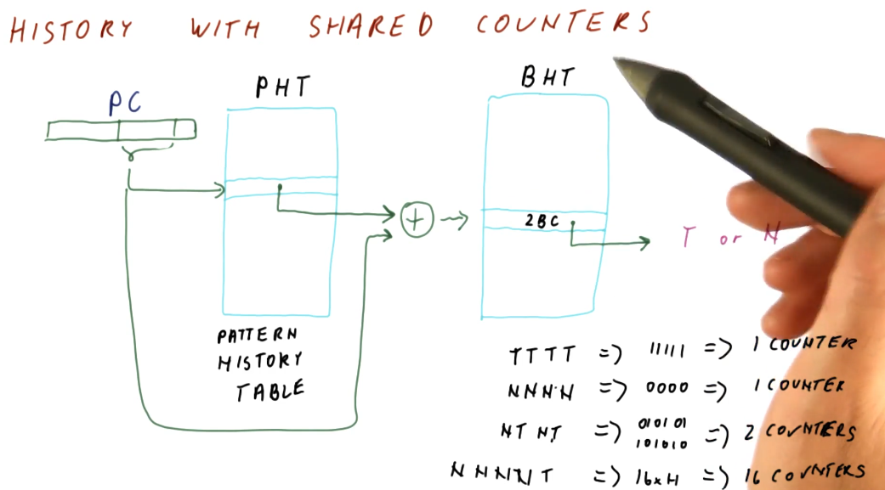

# History Based Predictors

History Based Predictors are designed to recognize and learn patterns based
upon the history of taken or not taken outcomes of a branch. Below is an example
that provides a high-level representation of the concept. The flip-floppy
branch outcomes are definitely predictable, just not with simple N-bit counters.

## 1 Bit History w/ 2BC

Below is an excerpt from the lectures that provides a high-level representation
of a BHT with 1 bit for history, and two 2BC's to manage the state for taken
and not taken branch outcomes.

What the 1 bit history 2BC BHT provides us is a predictor that is able to learn
the pattern of a series of branch outcomes. The 1 bit history bit is used to
index into the two 2BC's and, based upon the branch outcome, updates the state
of each 2BC.

## 1 Bit History Quiz

Below is an a quiz excerpt from the lectures demonstrating the calculation of
the number of mis-predictions for a pattern of branch outcomes following the
this pattern: `(NNT)*`. As we can see from the outcome of the calculations in
the quiz, the 1 Bit History with two 2BC's is not a good solution for this
pattern.

## 2 Bit History Predictor

The 2 Bit History Predictor works very similar to the 1 Bit History Predictor,
now we've just doubled the number of 2BCs. The 2 Bit History bits are used to
index into the four 2BCs. The total cost of the predictor is 10 bits per branch.
Below is a high-level representation of how a 2 Bit History Predictor can
perfectly predict the `(NNT)*` sequence.

Thinking more about our history predictors, some things become evident. For an
N-bit History Predictor:

* We can perfectly predict all patterns of length less than or equal to `N+1`.
* The cost for an N-bit History Predictor is `N + 2 * 2^N` **per entry**
* This is wasteful, most of the 2BCs will go unused.

## N-bit History Predictor Quiz

The below quiz is an excerpt from the lecture, outlining the cost and waste of
different size N-bit History Predictors.

## History Predictor Quiz

The below quiz is an excerpt from the lecture, demonstrating how to calculate
the number of entries in a history predictor necessary to support a branch
outcome pattern generated by these two `for` loops. As you can see, a lot of
2BCs are wasted just to support an 8 bit history.

## History w/ shared counters

As we discussed earlier, N-bit history predictors use `2^N` counter per entry,
even when we only use `N` counters to solve a pattern of `N` branch outcomes.
The idea proposed is to share 2BCs between program counter entries. We only use
`N` counters for `N` branch outcomes, so with enough counters there's a
possibility that we can share without having conflicts.

In the excerpt below, we see that designers use the **pattern history table**
abstraction to maintain history pattern history information in a different table
, separating it from the BHT. This way, 2BCs can be shared across multiple
program counters.

Program counters reference into the PHT in the same way they did with the BTH
and BTB, using the least significant bits that are unique. Some translation
logic is used to `XOR` the bits of the program counter and the pattern history
information from the PHT to reference the appropriate 2BC for the program
counter's pattern.

In this example, the size calculation for these two tables is explained, and the
overall cost is much less than the previous implementation of the N-bit history
predictor.

The below excerpt showcases how the BHT is used more efficiently with this
design. Patterns that are simple will only end up using 1 2BC, while other
patterns that have longer patterns will be able to utilize more counters
because less space is taken up by the patterns of other branches. The only
cost appended to this design is the creation of the pattern history table. Keep
in mind, with the indexing logic shown, it is still possible for branch entries
to collide in the BHT.

