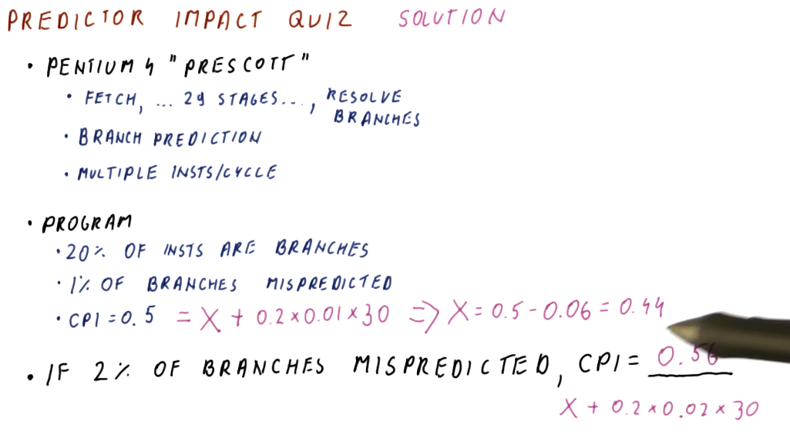
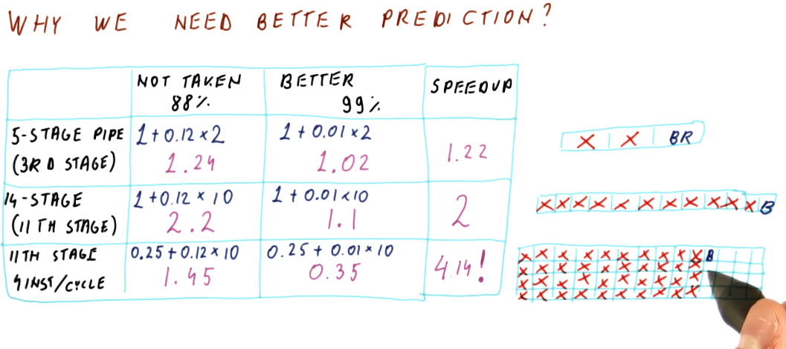
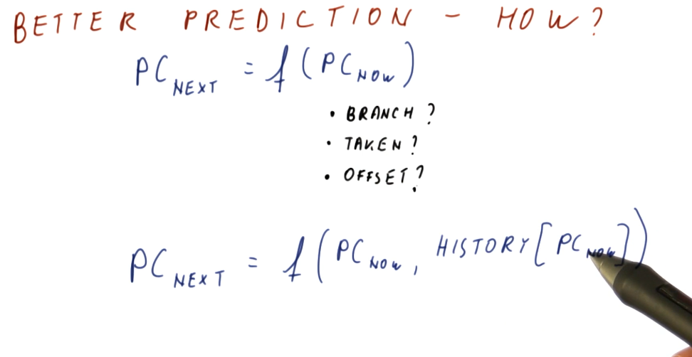

# Prediction

## Branch prediction requirements

What do we need in order to successfully predict whether a branch will be taken
or not? What do need in order to determine where the branch is going if it's
taken?

The requirements are as follows:

* Branch prediction needs to work using only the knowledge of where we fetch the
current instruction from.
  * We need branch prediction to guess the program counter of the next
instruction to fetch.
* With branch prediction we must correctly guess:
  * Is this a branch?
  * If it is a branch, is it taken?
  * If it is a taken branch, what is the target program counter?

## Branch prediction accuracy

The image below demonstrates how we can calculate the theoretical CPI of a
processor using branch prediction given its branch prediction accuracy,
penalty per missed prediction, and percentage of instructions that constitute
branches within a benchmark program. The equation is contains these components:

* `base CPI` - in the example below, this is `1`.
* `predictor accuracy` - this is the number of mis-predicted branches per
instruction.
* `penalty incurred` - the penalty is dictated by the number of stages in a
pipeline and when the branch instruction is evaluated.

A more accurate branch predictor increases our performance, decreasing the
number of penalties taken for mis-predicted branches, thus decreasing our CPI.
The amount of help a better predictor has changes depending upon how long the
processor pipeline is. Longer pipelines benefit more from better branch
prediction than shorter ones.

Below is branch prediction example problem. The key to this problem is the fact
that no branch prediction is being conducted so, until each instruction is
decoded, another instruction will not be fetched, thus creating a bubble within
the pipeline. So, non-branch instructions will take 2 cycles to execute and
branch instructions will take 3 cycles to execute. Instructions will not be
fetched after a branch instruction is decoded because the branch instruction
still has to be evaluated prior to fetching from the possible branch
destination.

In contrast, each instruction for the perfect branch predictor takes 1
instruction, no bubbles exist within the processor pipeline. This is because
the branch predictor knows which instruction will be fetched next before the
previous one is decoded - including the branches.

## Performance with not-taken prediction

A simple implementation of branch prediction that has an increase in performance
over just not predicting branches at all is the prediction that all branches
are **not taken**. If no predictions are made, ever, and instructions are only
fetched after previous instructions are decoded, branches will always take 3
cycles in our example 5 stage pipeline and regular instructions will take 2
cycles.

If we always assume the branch is not taken, sometimes we'll be right and the
branch will only use 1 cycle, while sometimes we'll be wrong and the branch
will use 3 cycles - this is still better than making no predictions at all. In
this model, regular instructions only take 1 cycle, as well.

## Predict not-taken

The **predict not-taken** predictor is the simplest predictor we can have, all
it does is increment the program counter. No extra hardware is required to
support the predict not-taken predictor - we should always have the ability to
increment the program counter.

A rule of thumb in computer architecture is that
**20 percent of all instructions are branches**. For branches, about
**60 percent of all branches are taken**. Thus, the predict not-taken predictor
is correct 80 percent of the time (because of non-branch instructions), plus
another 8 percent of the time (because of branch instructions). Overall, the
predict not-taken predictor is incorrect 12 percent of the time.

## Why do we need better prediction?

The image below provides examples for different types of pipelines, showcasing
the differences in performance using a predict not-taken predictor and a
branch predictor that is correct 99 percent of the time. As you can see, as the
processor pipeline gets longer and more complex, conducting more instructions
per cycle, branch prediction becomes really important for performance. The
ability to accurately predict branches achieves a speedup of 4 for the case
of the 14 stage pipeline with 4 instructions per cycle.

## Predictor impact quiz

Below is an example quiz that demonstrates how we can determine the impact
of a predictor on the CPI of a processor pipeline. Given some metrics about the
Pentium 4 processor, we are given a final CPI but not the theoretically ideal
CPI of the pipeline. Using the metrics given, we have to derive the ideal CPI
and then calculate the new CPI given a different mis-prediction percentage for
our predictor.

## Why we need better prediction, part 2

The below image displays how wasteful flushing the processor pipeline is when
we fail to accurately predict branches. Depending upon how many stages are
within a pipeline, while also accounting for the fact that we could execute
multiple instructions per cycle, we see that would fetch and flush anywhere from
2, to 10, to 40 instructions - pretty wasteful.

## How do we get better prediction?

In a [previous section](#branch-prediction-requirements), we discussed the
requirements that needed to be met in order to conduct branch prediction. In the
image below, the lecture discusses that we don't have the ability to determine
if the instruction is a branch, if the instruction is taken, or what the offset
of the branch is because we still have yet to fetch the instruction.

What we do know, however, is that, based upon the program counter, we have a
historical precedence for what happened at this program counter in the past. We
know how the branch at this program counter was behaving in the past - we can
use this information because it's pretty common that branches tend to behave the
same way each time they are encountered.

We don't know what the current branch instruction to be fetched is going to do,
but we can make a prediction based upon its history / the last time it was
executed.

