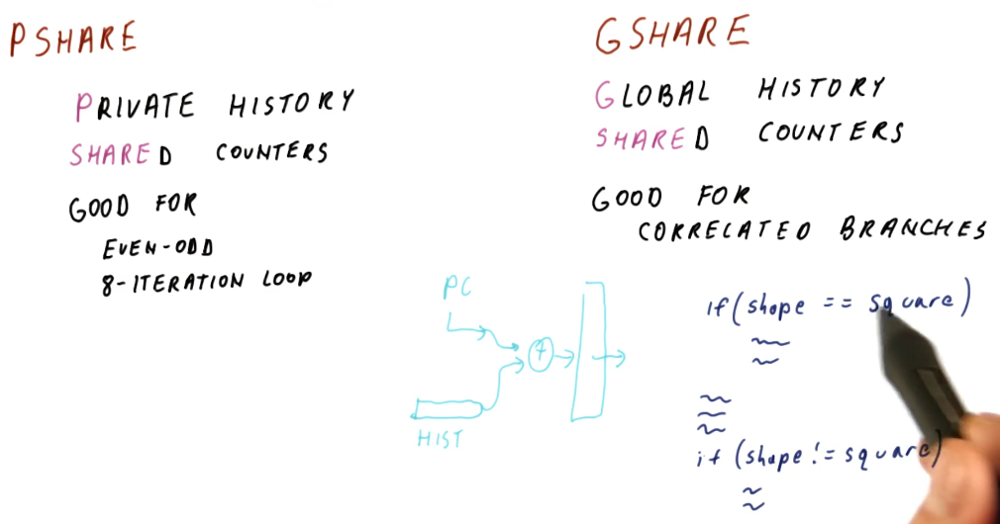

# PShare and GShare

The tail end of the
[history based predictor](./lesson4/../history-based-predictors.md) lesson
describes the beginnings of what's known as the **PShare**  predictor. What
does PShare stand for? **Private** history for each branch and
**Shared** counters so that different histories and counters might share the
same counter. The PShare predictor is good for flip-floppy branch outcomes and
8-iteration loops.

In contrast, we have **GShare** with **Global** history and **shared** counters.
What does global history mean? It means we have single history that is used to
predict all branch outcomes. So every history, regardless of program counter,
is used to calculate the counter for prediction. The GShare predictor is good
for **correlated branches**.

What's a correlated branch? These are branches whose decisions rely upon what
other branches in the program are doing. An example is provided in the excerpt
below, showcasing a decision statement where one of two actions will take place
depending upon the value of a `shape` variable. Only one branch will evaluate to
try, thus they are correlated branches.

## PShare vs GShare Quiz

Below is a quiz excerpt from the class explaining the differences between
PShare and GShare. Given some C code, we are provided what the C code would
resemble in assembly and then asked to determine how many bits of history
would be required to support the branches in the code using both PShare and
GShare.

The quiz demonstrates that it would be easy to predict the first and last
branches and that they don't require any history support. The first branch will
have the outcome of not taken 1000 times, and the last branch will have the
outcome of taken 1000 times. The second branch, however, will flip-flop between
taken and not taken, as each different integer will evaluate as even or odd.
Thus our PShare predictor will need `1` bit of history to support perfect
prediction of this branch's outcomes.

In contrast, GShare will require `3` bits of history to support the branches on
a global scale and in order to correctly predict the branch outcomes. Again,
the first and last branch outcomes are unlikely to change, however, the second
branch will flip-flop thus we need `3` bits of history to represent the
correlation between these branches. When we see that the first branch was not
taken, we'll also see the second branch either being taken or not taken, and
if the first branch wasn't taken we know that the third branch is taken.

## PShare or GShare

Historically, designers would pick one or the other of these history based
predictors. Eventually, designers realized they would need to use both as GShare
works well with predicting correlated branches and PShare works better with
self similar branches.