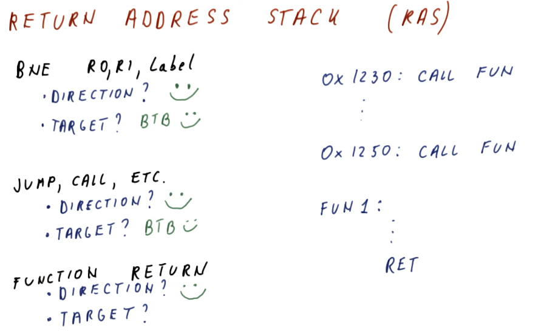

# Return Address Stack (RAS)

So far we've seen branch prediction done for branch and jump instructions, but
what about function `ret` instructions? Functions are designed to be called
anywhere, so their `ret` address will not always be the same location in code.
This makes them tougher to predict using our current methods of branch
prediction - how do we prevent from fetching instructions from the wrong
location when returning from a function?

The **return address stack** is a separate predictor used specifically for
predicting returns. It operates similar to the process stack in that it pushes
and pops return address for function calls onto the stack. The primary
difference between a process stack and the RAS is that the RAS is a very small
hardware structure designed to make a prediction very quickly.

So what happens when the RAS is full and we continue to call into more
functions? We have two options:

* Don't push any more return pointers into the RAS
* Wrap around and overwrite RAS entries

So, is it better to wrap around and overwrite RAS entries? The results of a quiz
from the class provides the justification for why it's better to wrap around
and overwrite RAS entries. In the provided justification below, we demonstrate
with a high-level diagram that if we don't push new entries into the RAS when
it's full, all we're doing is saving ourselves from mis-predicting older
functions calls for functions that aren't getting called often.

In contrast, if we wrap around the entries in the RAS, we're more effectively
using the entires we have in the RAS to correctly predict immediate function
call returns that are more likely to happen more often.

## So how do we know the instruction is a `ret`?

Right, we can't push and pop values to/from the RAS without knowing if the
instruction is actually a `ret`, and we only learn what the instruction is if
we fetch and decode. Two methods exist:

* We can use a predictor to determine if the program counter contains a `ret`.
Once the program counter is seen, we now know this program counter contains an
instruction that is a `ret` and we can then push the value onto the RAS.
* We can use **pre-decoding**!
  * The processor contains a cache that stores instructions that have been
fetched from memory. The processor fetches instructions from the cache unless
the processor incurs a cache miss - then the process will access memory to
acquire the next instruction.
  * Pre-decoding is a process in which we access memory to acquire the next
instruction, and as we acquire the next instruction we decode a little bit of it
to determine if it's a `ret` instruction. If it is, we store this information 
with the instruction in the cache.

