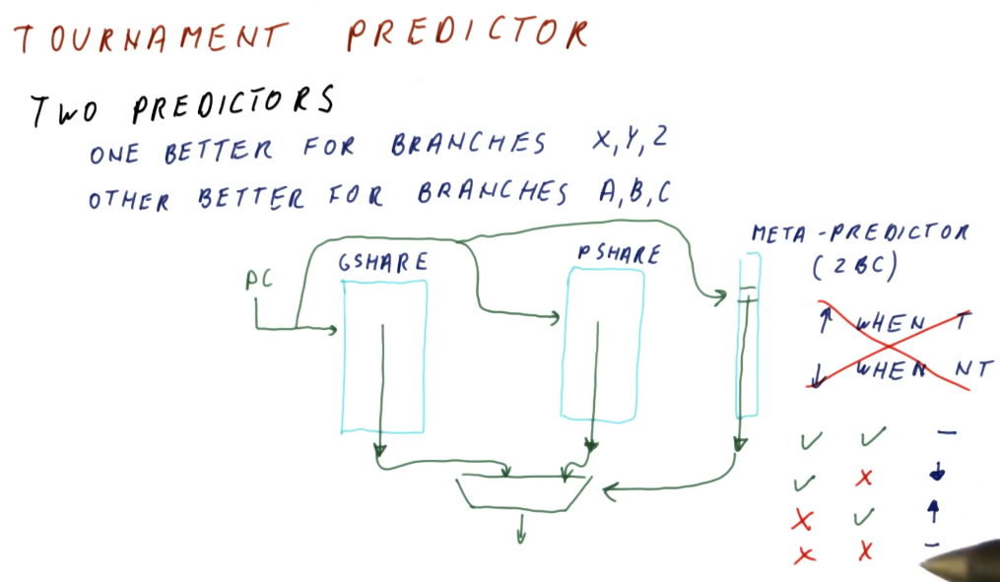

# Tournament Predictor

As we discussed in the [PShare and GShare](./lesson4/../pshare.md) section,
designers desired to use two predictors to handle different cases of branches -
correlated branches and branches that were self similar. But how do we determine
which predictor will be used for a program counter (instruction) if we don't
know what type of branch it is ahead of time?

The high-level representation below explains how the GShare and PShare
predictors are both indexed by the program counter and each predictor provides
a predicted branch outcome for that program counter value. At the same time, we
use the program counter to index into a **meta-predictor** table that has a
2BC at each index. We use the **meta-predictor** to keep track of which shared
predictor gives us the correct answer for the program counter the most often.

