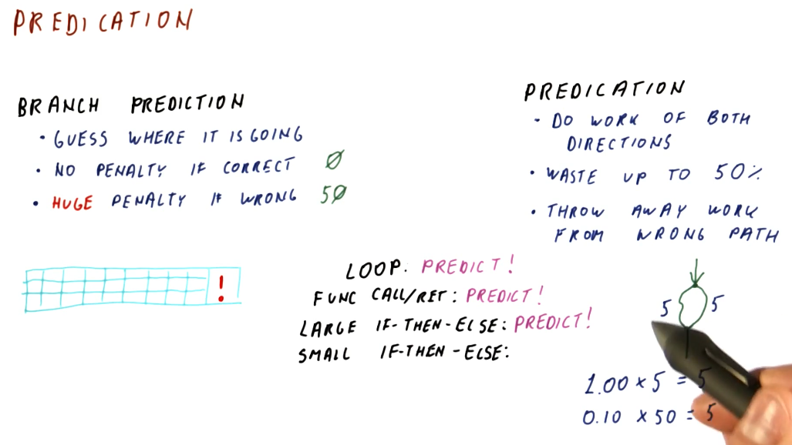
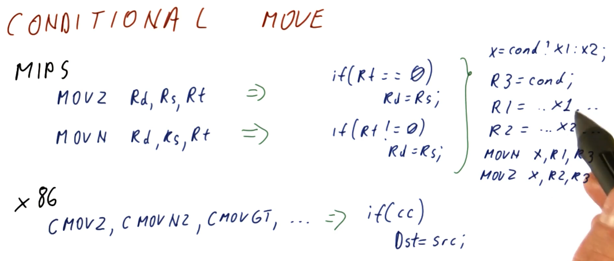
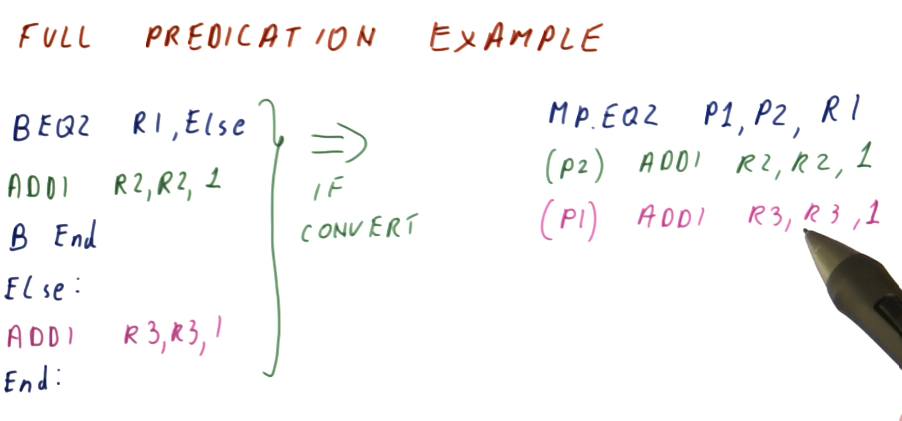

# Predication

## Summary

This lesson covers more topics in relation to control dependencies and the
hazards they pose. We covered a bunch of different branch predictors in
[lesson 4](./lesson4/branches.md) and we noticed that some branches are really
difficult to predict, even when we use really sophisticated branch predictors.

This lesson showcases how the compiler can help us to completely avoid hard to
predict branches.

## Predication explained

Like we covered in the previous lesson, with branch prediction we attempt to
guess the landing location of the branch and we begin fetching instructions from
that instruction sequence into the pipeline. If we are correct in our guess,
we incur no penalty. An incorrect guess incurs a penalty and, depending upon
how long our pipeline is, this penalty can be *huge*.

Contrast this with **predication**. In predication, we fetch instructions from
the instruction sequences of both possible landing locations for a branch. With
this technique, even if we guess correctly or incorrectly, we still have to toss
out 50% of the instructions that have been fetched into the processor pipeline.
We don't incur a penalty anymore, however, because we realistically aren't
making a guess, we're just saying yes to both outcomes of a branch instruction.

So if we're always incurring a penalty with predication, in what context is it
better than branch prediction? Here is a breakdown of the examples showcased in
the lecture:

* **Loops** - best application is a branch predictor. Loops are easier to
predict as the number of iterations increases. With predication, we would be
continuously fetching instructions from the instruction sequence after the loop,
wasting a lot of effort as those instructions will continuously flushed from the
pipeline - the branch that goes back into the loop will be taken almost always.
* **Function calls/ret** - best application is a branch predictor. The function
will always return, taking the branch instruction. No reason to fetch
instructions from the instruction sequence after a ret.
* **Large decision statements (if-then-else)** - best application is a branch
predictor, dependent upon the size of the instruction sequence that comprises
the decision statement and the length of the processor pipeline. If two
directions in a decision statement were both 100 instructions long and the
processor pipeline was 50 stages long, if we mis-predict we only incur a penalty
of 50 stages. If we predict correctly, we incur no penalty. In contrast, a
predicator will always incur the penalty of 100 because we load instructions
from both possible instruction sequences following the branch instruction.
* **Small decision statements (if-then-else)** - the best application is
predication. If two instruction sequence outcomes for a branch are both 5
instructions long, we will always incur a 5 instruction penalty with
predication. If we use branch prediction and the processor pipeline is 50 stages
long, if we make a mis-prediction, we'll have wasted 50 stages. Dependent upon
how accurate the branch predictor is, we might be able to match the performance
of predication in this use case, however, the more inaccurate the branch
predictor the less viable an option it will be for small decision statements.

## Conditional move

This section discusses the conditional move instructions available in the `MIPS`
and `x86` instruction sets. The example below covers `MOVZ` and `MOVN`:

* `MOVZ` - takes two sources and a destination register. If the third operand
is equal to `0`, the second operand is loaded into the destination register.
* `MOVN` - takes two sources and a destination register. If the third operand
is not equal to `0`, the second operand is loaded into the destination register.

Example `x86` `CMOV` instructions are shown below.

## MOVZ MOVN quiz

Below is quiz a on how to convert code that originally contains branch
instruction into code that uses conditional moves to avoid making predictions.
This code models a short decision statement that loads some values into
different variables based upon some condition statement.

## MOVZ MOVN performance

The excerpt from the lectures below showcases a comparison of the performance
between traditional branch prediction and the translation we did of the
instructions to enable predication. Give a branch predictor that's correct
80% of the time and incurs a 40 instruction penalty if we encounter a
mis-prediction, we average the number of instructions that can executed between
the two branch instruction sequences, `5 * 0.5 == 2.5`, and then we throw in our
inaccuracy and penalty: `2.5 + 0.2 * 40 == 10.5`.

So, on average, the branch predictor in this example incurs `10.5` instructions
worth of work to evaluate and execute this condition statement. In contrast, for
predication, all of the instructions are fetched and executed because we've
translated the branch into conditional move instructions. We incur `4`
instructions worth of work to evaluate and execute this condition statement.

## MOVx summary

To summarize predication using `MOVx`:

* Needs compiler support to translate eligible condition statements using `MOVx`
instructions rather than generating branch instructions
* Removes hard-to-predict branches, increasing performance
* More registers are needed in order to support predication using `MOVx`
  * Results from both instruction sequences have to be calculated and stored
* More instructions are executed
  * No branch prediction is conducted, both instruction sequences are executed
and their results are stored in registers
  * `MOVx` is used to select the results of the condition statement

So what portions of this summarized list are absolutely necessary to implement
predication? Well:

* Compiler support is definitely necessary
* The whole purpose of this is to remove hard-to-predict branches
* **We don't need more registers to store our results - we can conduct
comparison directly against values in memory**
* **We don't need to use `MOVx` to select results**

How do we remove the unnecessary portions of the summarization above? **We make
all of our instructions conditional!** With this, we can achieve *full
predication* - but it requires extensive support in the instruction set.

## Hardware support for full predication

Usually, we have a separate opcode for conditional move instructions. For **full
predication**, we add condition bits to *every instruction*. Below is an excerpt
from the lectures showcasing the Itanium instruction set's use of **qualifying
predicates** in its instructions to support full predication. Qualifying
predicates specify what register will be used to conduct a comparison for a
conditional move.

## Full predication example

The excerpt below now shows our previous condition statement convert to a set
of instructions that uses full predication. The first instruction sets the
qualifying predicates, `p1` and `p2`, to `0` or `1` based upon the value of `R1`
. If `R1` is `0`, `p1` is set and the instruction predicated by `p1` will
actually store its value into `R3` after execution. If `R1` is not `0`, `p2` is
set and the instruction predicated by `p2` will store its value into `R2` after
execution.

So, in the original code with branch instructions, we have the possibility of
executing 2 or 3 instructions based upon our prediction, but we still incur a
penalty. In our previous examples using `MOVx`, we were able to translate the
condition statement into a set of 4 instructions. Now, with hardware support for
full predication, we are able to translate this condition statement into 3
instructions.

## Full predication quiz

Below is a the full predication quiz solution from the lecture, conducting a
performance comparison between the original branch version of the condition
statement code to the full predication translation.

## References

1. [Lesson 5 Notes](./pdf/Lesson5Notes.pdf)