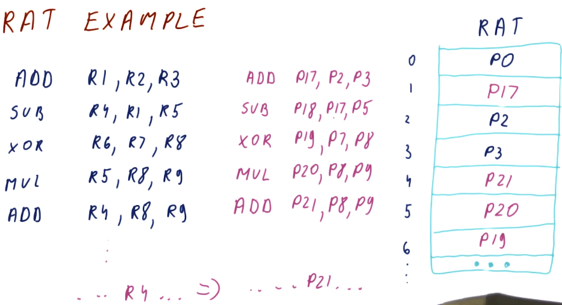

# False Dependencies

We covered this in previous portions of this notebook, but we'll go over the
dependency types once again. We have **true** dependencies and **false** or
**name** dependencies. A true dependency is the RAW (read after write)
dependency - pretty obvious because this is how the program is actually intended
to execute. Both the WAR (write after read) and WAW (write after write)
dependencies are false dependencies. In both of these dependencies, we are
re-using registers for instructions when we could change the registers being
used to eliminate the false dependencies completely.

## Duplicating register values

This is a complicated technique in which we save multiple **versions** of a
value for a register that is being written to. In the excerpt below, two
different writes occur for the register: `R4`. This register is used in two
different read operations, but what value will be used if the register is
written twice?

To remove the hazard posed by this WAW dependency, we store both versions of
`R4` and then each read operation will utilize the appropriate version based
upon the chronological order of the writes. The third instruction in this
example will use the outcome of the write in instruction two for its read
operation, even though instruction four writes to `R4` before instruction two
does. A future instruction will use the most previous version of `R4` for its
read operation, even though the write by instruction two occurs after the write
by instruction four.

Essentially, we are keeping track of all possible versions of a register in a
parallel pipeline and different read operations that require the value of
register will use the value generated by the most recent write operation.

## Register renaming

So duplicating and managing register values can get pretty complicated and time
consuming. Another technique processors can use to remove hazards created by
data dependencies is **register renaming**.

In the below excerpt from the lectures, we define some terms:

* **architectural registers** - these are register names used by the programmer
and the compiler.
* **physical registers** - these are the physical registers available to the
processor to actually store real values.
* **register allocation table** - this is a table used by the processor to
translate architectural register names to physical registers. This table defines
which physical register contains the data for a specified architectural
register.

The processor rewrites the program it's executing to use the physical registers.
Through register renaming, it will have more registers available to store values
and avoid hazards presented by data dependencies.

## RAT example

The below excerpt from the class showcases how a RAT works. Each time a new
value is produced, a different physical register is used to store that value.
Values for registers that are being read are acquired from the RAT after it
translates the architectural name to the physical register. We call the WAW and
WAR dependencies name dependencies because the name is the whole problem. If we
rename the register that the value is being written to for each write, the
instructions won't overwrite the work of the other instructions if they're
executing in parallel.

In this example, we can see that each write increments the physical register
number that's being written to. This removes the hazard of a register being
overwritten by a later instruction before an earlier instruction can conduct
its write. Because the writes are to different physical registers, when an
instruction is decoded and needs to read a register, the value it's reading is
going to be from the instruction prior, not the most recent write to the
register.

## Register renaming quiz

Below is a quiz for register renaming from the lectures. Pretty straightforward.

## False dependencies after renaming

So does renaming actually remove our WAR and WAW dependencies? Yes! In the below
excerpt from the lectures we are shown a program that contains a set of
dependencies for each instruction. Because each instruction has these
dependencies, they must be executed in order, causing us to have a CPI of `1`.
However, with renaming, we are able to eliminate the WAR and WAW dependencies
improving our performance to a CPI of `0.33`.

