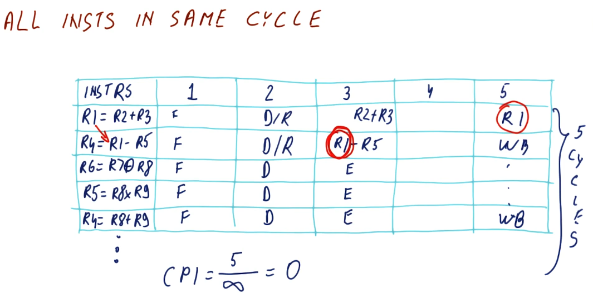
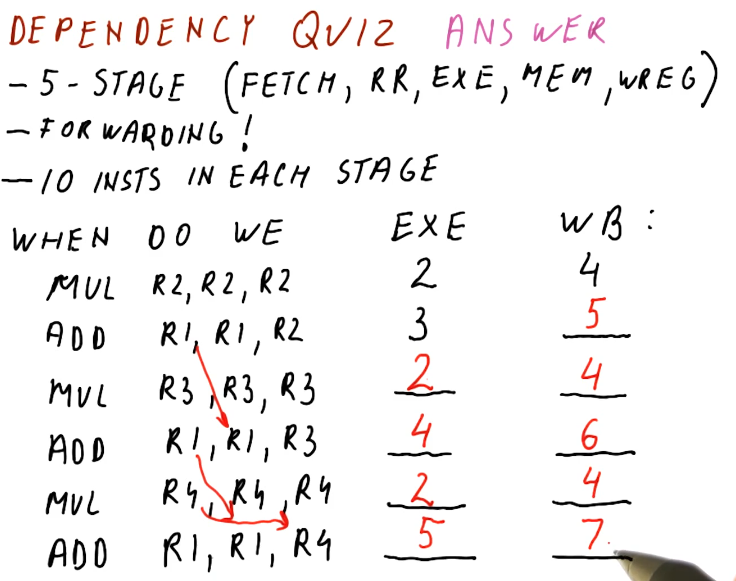

# Instruction Level Parallelism (ILP)

## Parallel instruction execution

The below excerpt from the lectures showcases the hazards that can manifest due
to data dependencies in parallel processor pipelines. As you can see here
multiple instructions are destined to be executed and, if all instructions are
able to be executed in parallel, it will take 5 cycles to execute a number of
instructions. As the number of instructions approaches infinity, our CPI
approaches `0`.

This isn't realistic - some instructions will depend upon earlier instructions
to write values to registers before the instruction is executed. If this isn't
done, we will encounter data hazards wherein the registers we use for our
instructions will contain stale values, ultimately causing the program to
execute incorrectly.

## The execute stage

In previous sections of this notebook we discussed forwarding, a technique that
can be used to resolve data dependencies and remove hazards. Unfortunately, this
technique wont' work for us when we're executing instructions in parallel. The
instruction that contains the data dependency will not receive the outcome of
the forwarded instruction before it executes because they are executed in
parallel.

In order to remove the hazard related to this data dependency, we must stall
the instruction until the previous instruction executes. Then, we will forward
the result of the executed instruction to the dependent instruction. This will
increase our CPI.

## RAW dependencies

The below excerpt from the lectures showcases how we can calculate the CPI
for a set of instructions based upon the number of data dependencies that exists
between them. As you can see, the more RAW dependencies that exist, the higher
our CPI.

## WAW dependencies

The below excerpt from the lectures showcases how a WAW dependency can manifest
due to a RAW dependency in previous instructions. The WAW dependency poses a
hazard because the previous instruction is stalled due to a RAW dependency. If
this goes ignored, the dependent instruction in the WAW dependency will write to
a register before the previous write, executing instructions out of order. In
order to solve this, the dependent instruction must be stalled twice so that the
previous instruction can write.

## Dependency quiz

Below is a quiz from the lectures in the class that showcases how multiple RAW
and WAW dependencies are handled in the processor pipeline.

