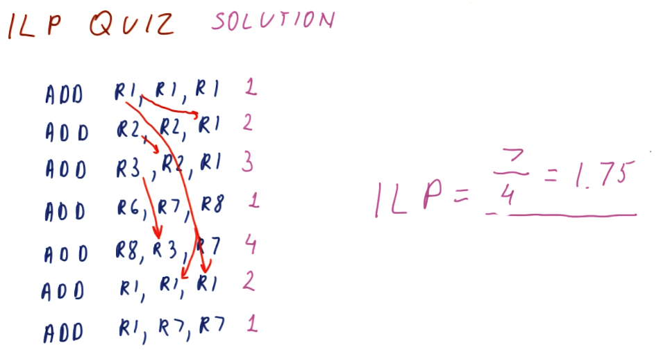
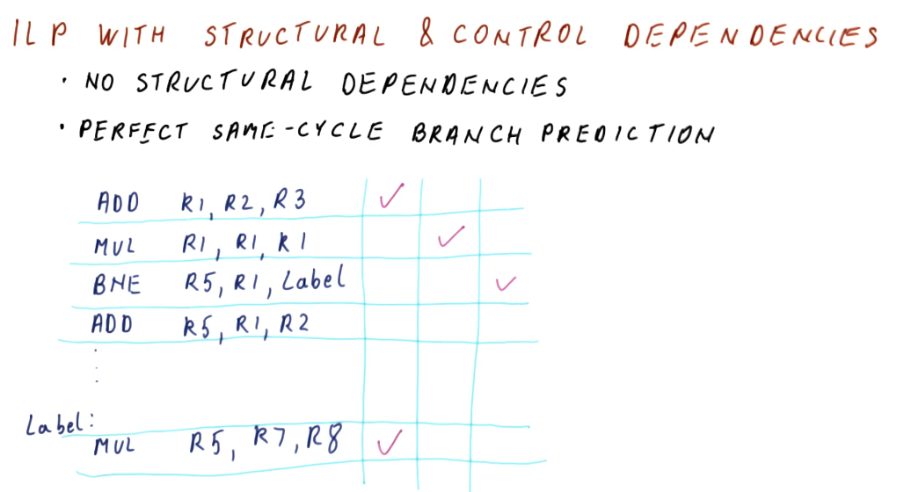
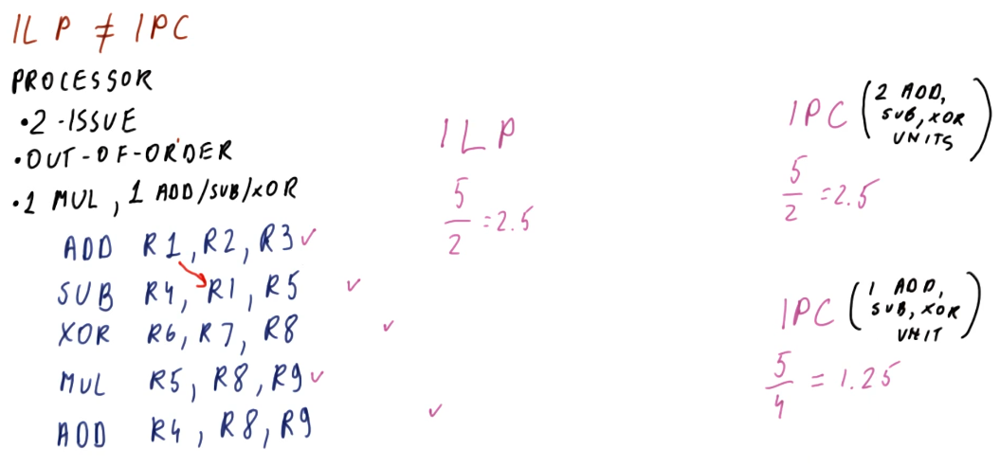
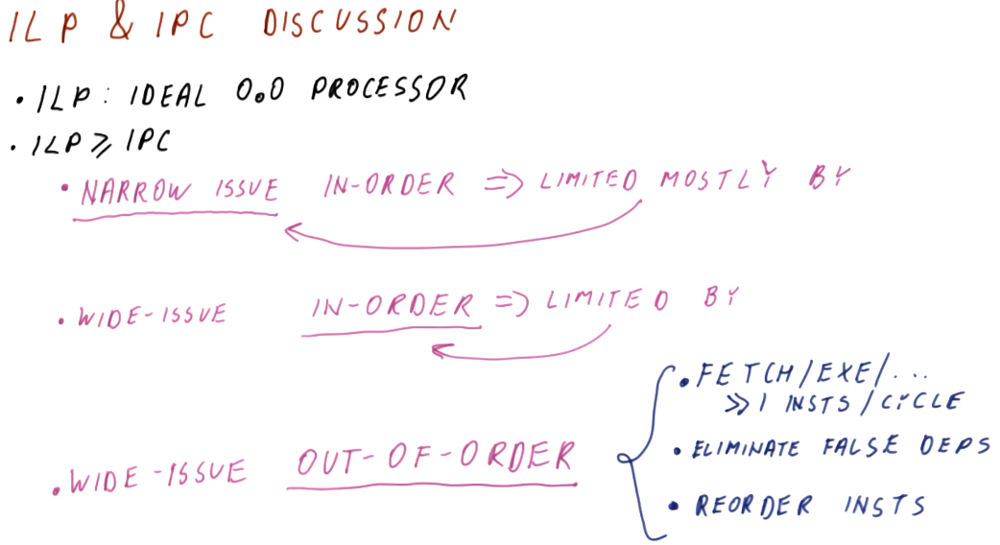

# What is ILP?

**Instruction level parallelism (ILP)** is a property of a program given the
fact that it's running on an *ideal processor*. What's an ideal processor? An
ideal processor has these attributes:

* Processor dispatches an entire instruction in `1` cycle.
* Processor can do any number of instructions in the same cycle.
  * The processor has to obey true dependencies when doing this.

So what are the steps to acquire the value of a program's ILP? A program's ILP
is equal to the IPC when executing on an ideal processor following the rules
stated above. Obviously ideal processors like this always aren't achievable, the
ILP for a program will be different on actual real-world processors. ILP gives
us a value, however, for the parallel nature of program - defining how many
true dependencies exist within the code.

The steps to acquire the ILP of a program are:

1. Rename the registers, as shown previously.
2. "Execute" the code on the ideal processor.

## ILP example

The below excerpt from the lectures showcases how we can compute the ILP for a
given set of instructions: `ILP == num instructions/cycles`. In this example,
the professor identifies the true dependencies that exists for the set of
instructions and sees that the fifth instruction cannot execute until the writes
of instruction one and three are complete. Thus, this program will take 2 cycles
on an ideal processor to execute.

A neat trick that is described in the lecture is that we don't even have to
conduct register renaming in order to calculate the ILP. All we have to do is
identify the true dependencies - the register renaming will take care of the
false or name dependencies for us.

## ILP quiz

Below is a quiz from the lectures showcase the technique for calculating ILP
described above. We don't conduct register renaming, we just identify the true
dependencies to determine on what cycle instructions are eligible to execute.
After we determine the minimum number of cycles to resolve the true
dependencies, we can find the ILP of the program.

## Calculating ILP with structural and control dependencies

When calculating ILP, we don't account for **structural dependencies**. These
dependencies result for architectural issues like not having an adder available
for a specific operation, etc. Something outside of the programmer's control,
solely relies with the manufacturing of the processor.

For **control dependencies**, we essentially ignore them. We assume that we
have perfect same-cycle branch prediction. In the example below, we show that
a branch instruction has a data dependency on instructions prior to it, however,
because we have perfect branch prediction we know that we will jump to the
`Label`. Thus, we fetch the instructions from the `Label` and execute them, even
though our branch has not been executed, yet.

## ILP vs IPC

Below is an excerpt from the class conducting a comparison of the calculations
for ILP vs IPC on a given example processor. The processor has some limitations
such as: 2-issue (2 instructions / cycle), 1 MUL and 1 ADD/SUB/XOR components
(structural limitations). With this, we calculate the ILP for the given
instructions and then we calculate the IPC twice: once ignoring the structural
limitations and once factoring in the structural limitations.

As we can see, the IPC for a processor can only be equal to or less than the
ILP. Real processors will have limitations and won't always be able to achieve
the ILP of a program.

## ILP vs IPC quiz

Below is a quiz from the lecture that shows us how to calculate and compare the
ILP and IPC of a program for a given test processor. Note, the processor in this
example can only dispatch instructions **in order**, thus degrading our
performance in comparison with the out of order processor's we've seen in the
past. This limitation causes us to have to stop dispatching instructions when we
encounter a dependency.

## ILP vs IPC discussion

This slide sorta restates what we covered earlier - a summary, essentially. The
ILP can only be calculated using the abstract concept of an ideal processor, and
it's generally representative of the best performance of a program. The ILP
will always be greater than or equal to the IPC, and the IPC is calculated using
an actual processor with issue and structural limitations.

The limitations for processors and how they affect IPC breaks down like this:

* If a processor **narrowly issues** instructions (1 - 2 instructions / cycle),
and only executes instructions **in order**, the processor will mostly be
limited by the **narrowly issued** attribute.
* If a processor **widely issues** instructions (4 or more instructions / cycle)
, and only executes instructions **in order**, the processor will mostly be
limited by the **in order** attribute.
* The *best* case is when the processor **widely issues** instructions but also
can execute instructions **out of order**. To do this, the processor will have
to dispatch a lot of instructions per cycle, eliminate false dependencies
through register renaming, and reorder instructions so they can be executed out
of order.

