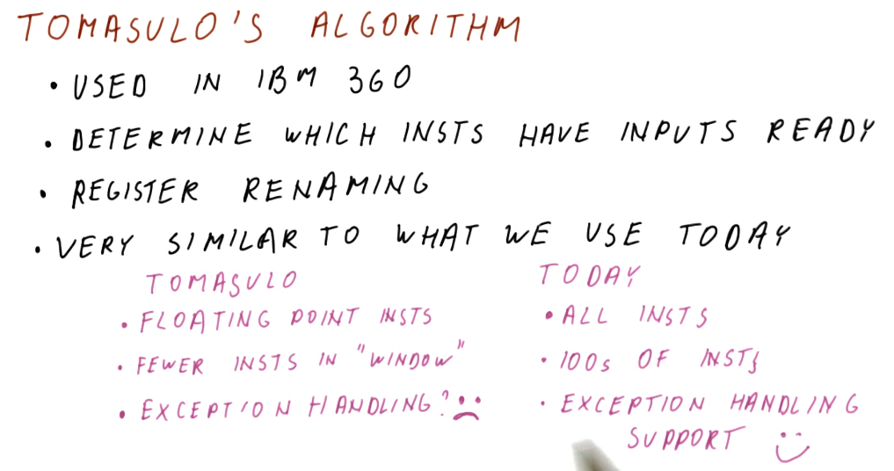

# Instruction Scheduling

This lesson covers how **instruction scheduling** allows us to execute programs
faster by dispatching more than one instruction per cycle while also handling
data dependencies.

## Improving IPC

As we've seen in previous lectures, there are multiple ways for us to improve
IPC:

* **Handling control dependencies** - if we have good **branch prediction** we
can better handle control dependencies, allowing us to fetch the correct
instructions and avoid wasting cycles.
* **false data dependencies** - when we encounter false or name dependencies
(WAR and WAW), we use **register renaming** to completely eliminate the hazards
posed by these data dependencies.
* **true data dependencies** - we can improve our performance even when RAW
dependencies are present using **out-of-order** execution. We find instructions
that are not dependent upon the writes of previous instructions and execute
those while we wait for the results of an instruction to be forwarded to
dependent instructions.
* **structural dependencies** - to improve our performance we must use wider
issuing processors - we'll be able to dispatch more instructions because we'll
have more resources available.

## Tomasulo's algorithm

Tomasulo's algorithm is the basis for modern processors' implementation of
out-of-order execution. It solves the requirements for **register renaming**,
and is able to determine which instructions have input ready and which
instructions are dependent upon pending writes. Below is an excerpt from the
class describing what the differences are between Tomasulo's algorithm and how
modern processors are designed.

## Tomasulo's algorithm - the big picture

Below is an excerpt from the class drawing out the components that comprise
Tomasulo's algorithm. There are a lot of moving parts and they'll be broken
down into more detail later - right now we're just summarizing the pieces. Here
is a quick description of all of the parts:

* **instruction queue** - the instruction queue is pretty self explanatory, this
is where instructions sit and wait to be **issued** - they are fetched from
memory.
* **reservation station** - Tomasulo's algorithm was designed for floating point
instructions, so this is where those types of instructions wait for their
required values before being **dispatched**. The reservation stations are split
into simple instructions that require and adder and more complex instructions
that might require a multiplier. Reservation stations enable Tomasulo's
algorithm to determine which instructions are ready to execute - implementing
out-of-order execution.
* **registers** - once instructions are dispatched from the reservation stations
, the values they generate are written (**broadcasted**) to the registers.
Instructions in other reservation stations will be able to acquire their
forwarded values so that they can be dispatched as well.

On the left-hand side of this picture, you'll see that there's logic to cover
load and store instructions as well. These were not handled by Tomasulo's
algorithm, but modern processors now handle all instruction types similar to
Tomasulo's algorithm. The results of the load and store instructions are also
**broadcasted** so that other instructions waiting to be dispatched can take
advantage of the values before they are written.

There are three stages of Tomasulo's algorithm:

* **issue** - this is when an instruction is sorted from the instruction queue
into either load / store or a floating point instruction.
* **dispatch** - this is when an instruction is actually executing using
processor resources.
* **write result (broadcast)** - this is when the result of the instruction is
written to the registers file for later use by dependent instructions.

**Note** - the instructions in the reservation stations also have two inputs
per station to receive broadcasts. This is to provide dependent instructions
with the necessary values to be dispatched as early as possible.

## References

1. [Lesson 7 Notes](./pdf/Lesson7Notes.pdf)