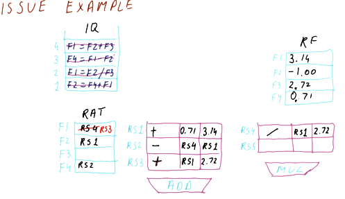

# Issuing

Here are the steps that occur for **issuing** in Tomasulo's algorithm:

* Take the next instruction, in program order, from the instruction queue.
  * This must be done in program order in order for register renaming to work
correctly.
* Determine where input for an instruction originates.
  * Are the inputs required located in the register file? Or are we still
waiting on an instruction to generate the necessary values? If we need to wait
for an instruction, which one? This will utilize a RAT.
* Find a free reservation station of the correct type (addr or mult).
  * If all the reservation stations are busy, no instructions are issued this
cycle.
* Put the instruction in the reservation station.
* Tag the destination register for the result of the instruction being issued.
  * This allows instructions who need this result to be able to reference the
correct name and identify their dependency.

## Issuing example

Below is an excerpt from the class that showcases how issuing works. Each
instruction is issued from the example instruction queue, and the instruction
queue is shifted when an instruction is successfully issued. The are plenty of
reservation stations available, so no instructions had to wait in order to
acquire a spot in a station.

Following the steps above, before an instruction is issued its inputs must be
translated using the RAT. If the value is available, the instruction will
read the input directly from the register file. The values that instructions
generate will be renamed and the RAT will contain the name of the reservation
station for generated values. This way, when other instructions that depend upon
a register value are issued, they will use the input generated from other
instructions by using their reservation station name.

## Issue quiz

Below is a quiz from the lectures where we practice the issuing portion of
Tomasulo's algorithm. In this example, we are unable to issue the second
instruction because there are no spots left in the reservation stations. This
example is pretty straightforward.

