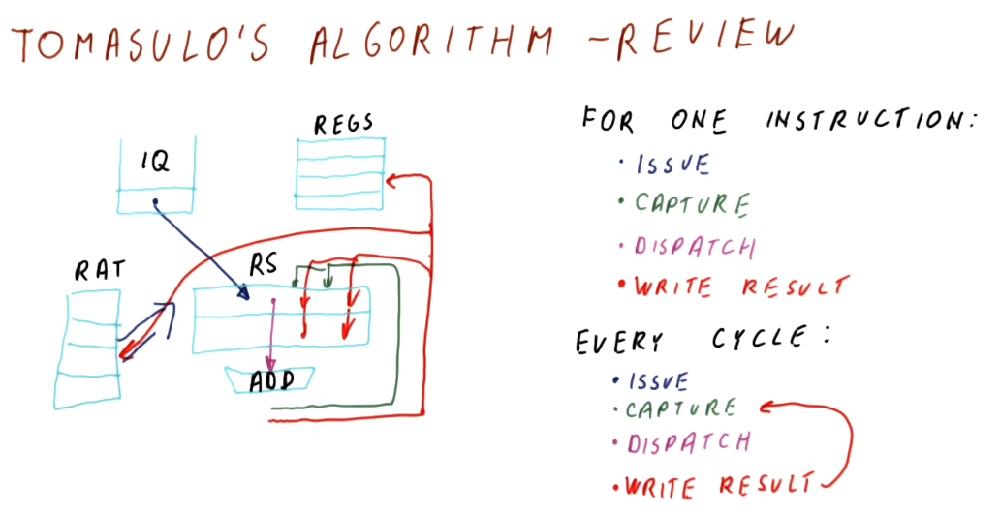
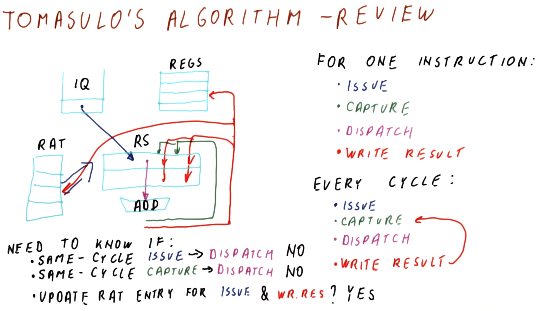

# Review

## Part 1

Below is a summarization of Tomasulo's algorithm. In this algorithm, for each
instruction we are:

* **issuing** - resolving the registers for an instruction using the RAT and
then updating the RAT with the reservation station name of an instruction
generating values.
* **capturing** - capturing output of instructions while in the reservation
station.
* **dispatching** - dispatching ready-to-execute instructions.
* **writing results** - broadcasting the results of instructions to instructions
capturing output in the reservation station, updating the register file and the
RAT.

An awesome thing to note as that each of these things is happening for different
instructions on each cycle. Every instruction is in one of these stages as we execute instructions out of order.

## Part 2

Below is an excerpt from the lecture that provides some further discussion of
Tomasulo's algorithm. Some questions that are posed:

* **Can we issue and dispatch an instruction in the same cycle?** - no, we
cannot. During an issue and instruction is loaded into the reservation station,
we won't be able to dispatch it until we identify that it is ready for
executing. While its dependencies may be resolved when being entered into the
reservation station, we won't know it's ready to be dispatched until the next
cycle.
* **Can we capture and dispatch an instruction in the same cycle?** - also no,
for similar reasons as above. Once an instruction has captured all of its
necessary values, it still needs to be marked for execution after the
reservation stations have resolved which instructions are ready. This can happen
if hardware support is available.
* **Can we update the RAT entry for an issue and a broadcast in the same
cycle?** - yes, the broadcast and the issue can procedures can both update the
RAT in the same cycle, however, the issue will be the last to update the RAT.
This way, future instructions will reference the output of the reservation
station by the issue, not by the broadcast.

## One cycle quiz part 1

Below is a quiz from the lectures where we practice predicting what values will
exist in the register file and the RAT after one cycle takes place. In this
example we have a processor that does not allow issuing and dispatching in the
same cycle, but does allow capturing and dispatching and updating the RAT and
writing to the register file in the same cycle.

Given the values provided for the different parts of the scheduler, we are able
to determine that the `F1` entry in the RAT will be updated by the instruction
being issued, and the register file entry for `F0` will be updated by the
broadcast of `RS0`. Simultaneously, the entry for `F0` in the RAT will be
cleared.

## One cycle quiz part 2

Below is a quiz from the lectures where we practice predicting what values will
exist in the reservation station for a cycle of the processor pipeline. We can
see that an instruction is issued, an instruction is freed from the reservation
station upon dispatch, the same instruction that was just issued is able to
capture the broadcast of the dispatched instruction.

## One cycle quiz part 3

Below is a quiz from the lectures where we predict what instruction will be
dispatched from the reservation station in the example cycle. We can see that,
as soon as the instruction in `RS1` captures its required value, it will be
dispatched. The instruction in `RS2` will not be eligible for dispatch because
this processor does not allow issuing and dispatching in the same cycle.

## Tomasulo's algorithm quiz

Below is a quiz from the lectures quizzing us on what is **not** true about
Tomasulo's algorithm. What's not true? Tomasulo's algorithm **does not**
dispatch instructions in program order and it **does not** write results in
program order. Tomasulo's algorithm **does** *issue* instructions in program
order.

