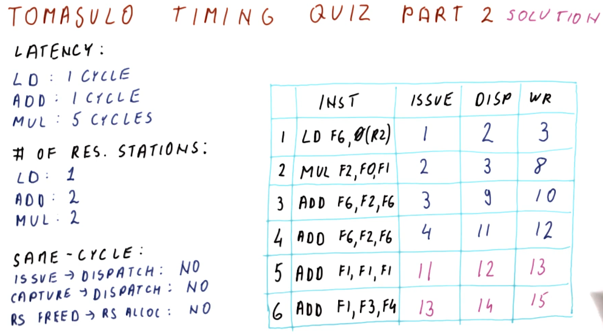

# Timing

Below is a quiz on timing from the lecture. Now that we understand the inner
working of Tomasulo's algorithm, we predict how long it takes for instructions
in the queue to execute based upon the rules provided.

## Timing quiz part 2

Below is the second part of the previous quiz. Of note, instruction 5 is unable
to be dispatched until cycle 11 because the reservation stations are held by
instructions 3 and 4. Instruction 6 cannot be issued until instruction 4
completes its write back and is cleared from the reservation station.

