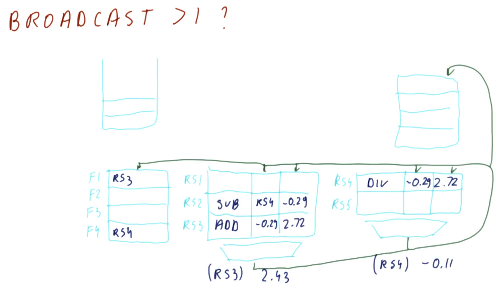

# Writing (Broadcast)

Below is an excerpt from the lectures that shows us what happens when a result
is written or broadcasted to the reservation stations and the register file.
Some steps take place:

* The result is tagged with the reservation station that is generating this
result. This combo is then emitted onto the bus.
* The result is written to the register file. We are able to determine what
register is being written based upon the RAT - it will contain the name of the
reservation station for the appropriate register.
* The RAT is then updated, clearing the reservation station name from the table
and marking the location for a register as clear.
* The spot the instruction held in the reservation station is freed.

## More than 1 broadcast?

There are multiple possibilities that we can consider when handling multiple
broadcasts. The first idea is to make more than one bus available - a bus for
each dispatch unit in the processor. While that sounds like a good idea, the
number of structural dependencies to implement this doubles for each bus -
that's a lot of resources and more logic is needed in order to correctly direct
the different values being generated.

Another option is to give priority to one dispatch unit over the other, and this
is the more likely case. In the example below, we give more priority to the
slower dispatch unit. Why? Because if one dispatch unit is slower, it's more
likely that faster dispatch units are waiting on values to be broadcasted by
the slower one.

## Stale broadcasts

Can we have stale broadcasts? Is that really a thing? Not necessarily. In the
example below we see that a broadcast is occurring for `RS4`, but there's no
entry for that reservation station in the RAT. So where will this result be
written to - what's its destination?

We can see that `RS2` is generating a value and it has overwritten `F4`, which
was the original destination of `RS4`'s value - this is perfectly fine and works
as intended. `RS2` was the only instruction that depended on the output of
`RS4`, it will have the value it needs to update `F4`. All subsequent
instructions reading `F4` will utilize the value generated by `RS2` - the
"stale" value being broadcasted by `RS4` won't cause any issues.

