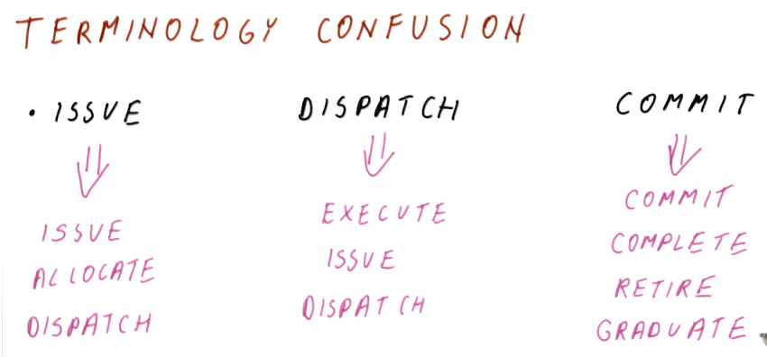
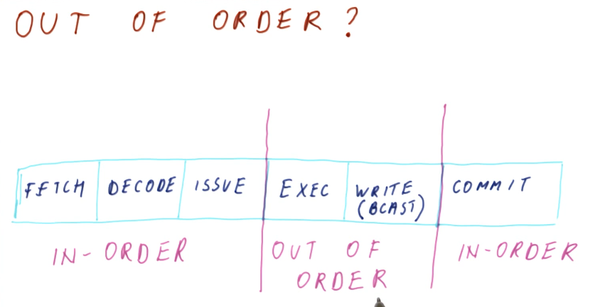

# Extra Topics

## Unified reservation stations

Unified reservation stations are touched upon in the below excerpt for the class
. With unified reservation stations, we gain the ability to issue more
instructions because we aren't segregating our instructions into two groups -
instructions will now gain a reservation station based on a
first-come-first-served basis. This will allow our pipeline to stop less often
as well, as we will always be able to make the most of our available space.

A drawback for unified reservation stations is that more logic is required in
order to implement this change. We must now include logic in order to sort
between which instructions use what structural capability (ADDR or MUL) and we
also need to be able to selected two instructions for execution per cycle, one
ADDR and one MUL.

## Superscalar processors

The below excerpt from the lectures discusses the requirements to implement
superscalar processors. The central takeaway from this discussion is that a
superscalar processor will only be as strong as its weakest link. If an
operation in this listing presents itself as a bottleneck, our performance will
only be as good as that one operation.

## Terminology confusion

This excerpt from the lectures clears up any possible confusion between the
terminology used for Tomasulo's algorithm in academia and what terms are used
in the industry.

## Out of order?

In our recent discussions, we've been issuing instructions one-by-one. What is
really out of order in Tomasulo's algorithm that provides us a performance
increase? The below excerpt from the lectures further discusses this.

The central takeaway is that these portions of the pipeline have this behavior:

* **Fetch, decode, and issue** stages happen in program order in order to
identify and resolve dependencies.
* **Execute and write result (broadcast)** stages happen out of order.
* The **commit** stage happens in program order to give the appearance
externally that we are executing instructions in program order.

## In-order vs out-of-order quiz

The below excerpt is a quiz from the lecture requiring us to identify what
parts of the pipeline are conducted in program order.

