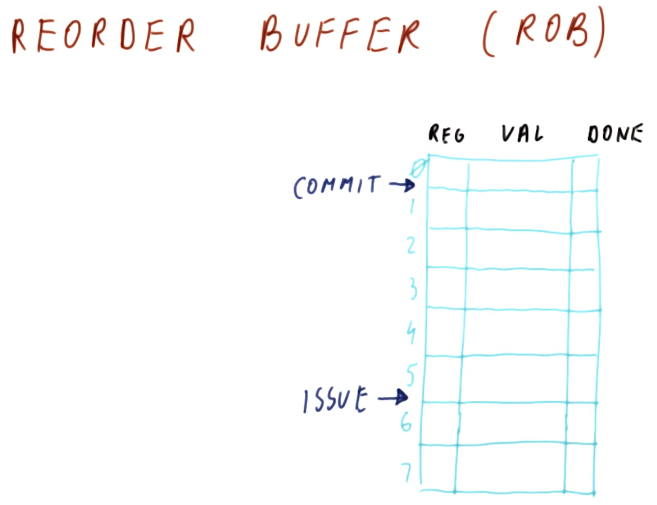
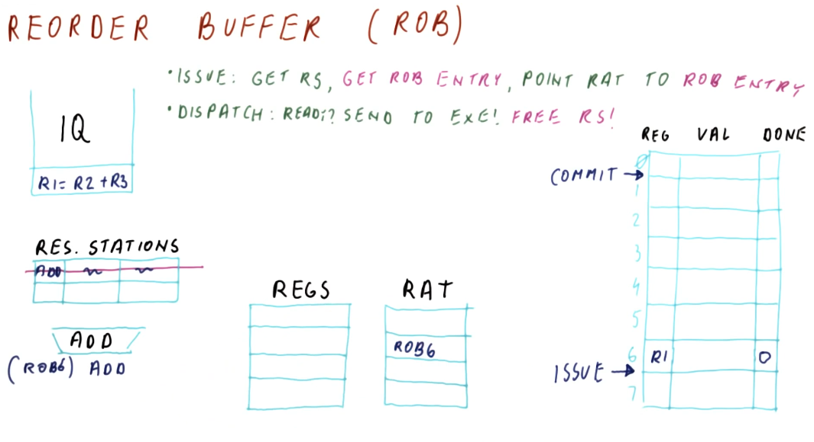
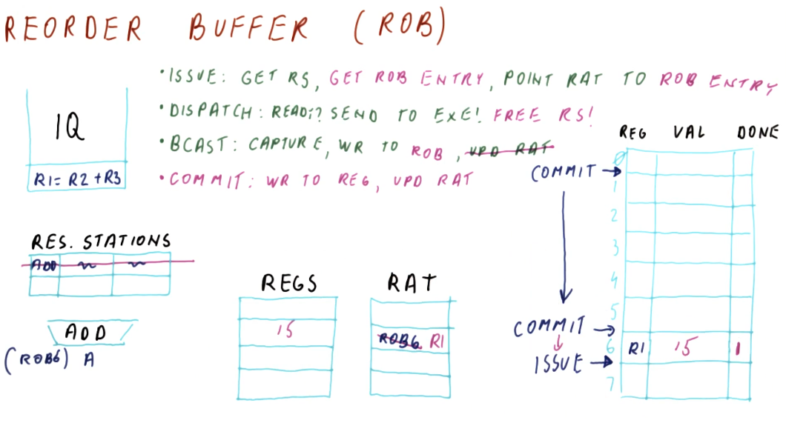

# ROB In Depth

## Part 1

The below excerpt from the class gives us a high-level representation of the
components of the reorder buffer. The reorder buffer is a table of values, this
is what each column represents:

* **reg** - the target register for writing
* **val** - the result of an instruction
* **done** - determines if the data contained in the value column is valid for
writing

The reorder buffer also uses two pointers for **commit** and **issue**, helping
to maintain the results of the instructions in program order. As new
instructions are issued they are enqueued into the buffer using the **issue**
pointer. The **commit** pointer points to the oldest instruction that will be
written to its respective register. The instructions between the **commit** and
**issue** pointers have been deemed valid for writing.

## Part 2

The below excerpt from the lectures shows, in detail, how the ROB mechanism is
appended into Tomasulo's algorithm to support handling exceptions for ooo
execution.

The changes that are made to the algorithm are:

* During an **issue** operation, the RAT now uses the name of the ROB entry for
a register instead of the reservation station.
* During a **dispatch** operation, the reservation station can be immediately
freed because the results of the operation will be using the ROB name instead of
the reservation station name.

## Part 3

The below excerpt from the lectures explains the changes between Tomasulo's
algorithm with and without the ROB and how the ROB supports ooo execution with
exceptions.

The changes that are made to the algorithm are:

* During the **write back** or **broadcast** operation, the values are still
**captured** by instructions waiting in the reservation stations. However,
instead of writing the values to the registers and clearing the RAT like normal,
the values are written to the ROB, and the RAT maintains its name value for the
ROB entry.
* A fourth operation is appended called **commit**. In the **commit** stage, we
write the value of the register pointed to by the **commit** pointer, and we
update the RAT to point to the newly written register instead of the ROB entry.

