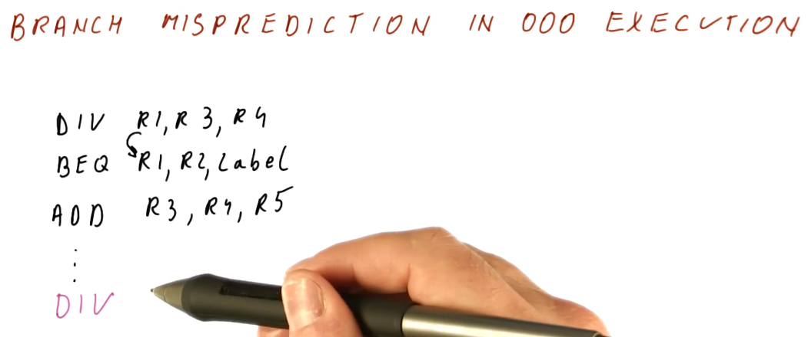

# Reorder Buffer (ROB)

Processors can improve performance a lot by reordering instructions. But what
happens when the reordering of instructions causes exceptions to happen, like
division by zero? This lesson explains how processors cleanup reordered
instructions when exceptions happen.

## Exceptions in out-of-order execution

Below is an excerpt from the lecture showcasing how exceptions can negatively
affect processors that support out-of-order execution. As we can see in this
example, instruction 1 takes 40 cycles to complete, however, it encounters an
exception where a divide by zero was attempted.

The program counter is saved and an exception handler takes over. After the
exception handler executes, the program is restarted from the `DIV` instruction.
Unfortunately, the other three instructions have already executed and have
written their results to the registers - thus the `DIV` instruction will be
using the incorrect value for `F0` and it will not execute as intended.

## Branch mis-prediction in ooo execution

Below is an excerpt for the lecture covering how branch mis-prediction can also
negatively affect our ability to execute instructions out-of-order. In the
provided example, the outcome of a `DIV` instruction determines the jump 
location for the succeeding `BEQ` instruction.

In this example, mis-predicting the branch causes us to fetch and execute the
succeeding `ADD` instruction, writing values to `R3`. Now, when the branch is
actually evaluated and executed, we jump to the real landing location of the
branch, however, because of ooo execution our value for `R3` has been modified
incorrectly - succeeding instructions will not execute as intended.

Another example is provided in which we mis-predict the branch and fetch a `DIV`
instruction. This `DIV` instruction causes a divide by zero exception, but the
`DIV` instruction was never meant to be executed - a `phantom exception`. The
processor goes through all of the steps to handle the exception when, in
reality, we were never supposed to execute the `DIV` anyways.

## Correct ooo execution

Below is an excerpt from the lectures explain what needs to be done in order to
achieve correct ooo execution. We can still execute instructions and broadcast
their results ooo, however, we must deposit the resulting values of instructions
to registers in order - this is not done by Tomasulo's algorithm which is why
we are having problems handling exceptions.

We utilize a mechanism called the **reorder buffer** that remembers program
order, even after the **issue** stage, and keeps results of instructions until
it is deemed safe to write these results to registers.

## References

1. [Lesson 8 Notes](./pdf/Lesson8Notes.pdf)