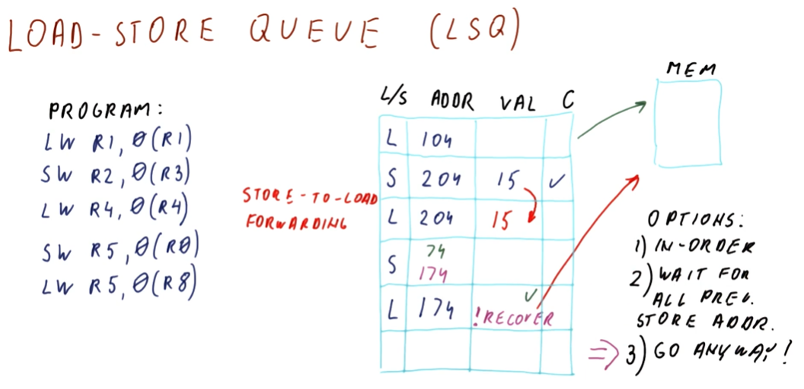
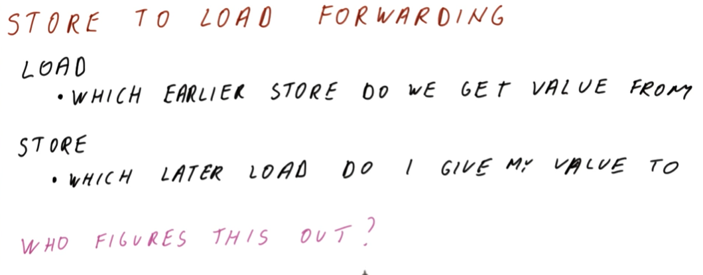

# Load-Store Queue (LSQ)

The `load-store queue` is similar to the `ROB`. This queue contains load and
store instructions in the sequence in which they will be committed. The fields
are as follows:

* `l/s` - bit that identifies whether the current entry is a load or store
instruction.
* `addr` - the address the instruction is accessing.
* `val` - field for the value that the instruction should be loading or storing.
* `c` - marks if the entry has been committed.

The `load-store queue` also implements a mechanism called
`store-to-load forwarding`. If a load operation has a matching store operation
preceding it, meaning the load operation in question is loading from a
previously written memory location, we can forward the value of the preceding
store operation in the queue to the load operation in the queue. This affords
us the ability to avoid having to access memory at an already written to
location - we already know the value it contains thanks to the queue.

Below is a high-level representation of the concepts discussed above.

## Load-Store Queue part 2

So what happens when we have a `load` instruction and we know the target address
, but we didn't previously `store` to this location so we don't know the value
for forwarding purposes? We have three options that have been considered:

* **in-order** - in this case, we execute all the instructions in order to
ensure the fidelity of the contents of our target address. This defeats the
purpose of our discussion as we want to conduct out-of-order execution - we want
all the `load` instructions to execute as soon as possible.
* **wait for all stores** - in this case, we wait for all previous `store`
instructions to execute before executing our `load` instruction.
* **go anyway** - the most aggressive option - we execute the `load` instruction
as soon as we resolve the target address.

Two things can happen for the **go anyway** option:

* Previous store instructions will resolve their target addresses and we
determine that it *was* safe for us to `load` from our target.
* Previous store instructions resolve their target address and we realize that
the target was supposed to be *written to* before we executed our `load`
instruction. Thus, we've `load`ed an incorrect value from memory and we need to
**recover**. In this case, `store` instructions will check if any `load`
operations succeeding them match their target address. If so, if they are
marked complete in the queue, the `store` instruction will mark them incomplete.

Most modern processors use the **go anyway** option as they produce the best
performance.

## Store to load forwarding

Some central questions need to be answered for `store-to-load forwarding`. Below
is the lecture snapshot containing these questions.

## LSQ example

Below is a more detailed representation of the `load-store queue`.

