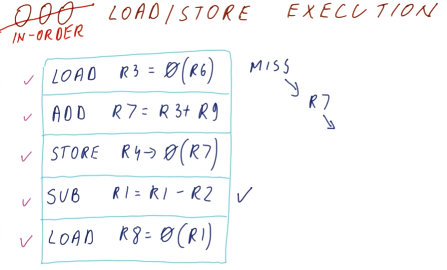

# OOO Load/Store Execution

The below example discusses the intricacies of out-of-order execution of load
and store instructions. In the example provided, the `sub` operation is able
to execute out-of-order because it has no dependencies. Once it produces a value
for `R1`, we execute the dependent `load` instruction. Meanwhile, the first
`load` in the queue encountered a cache miss and is waiting memory addressed by
`R6` to be loaded.

When the first `load` instruction finally completes, the dependent store
instruction resolves its target address with the previous `add` and notices that
the succeeding `load` also target the same address. Thus, the succeeding `load`
instruction loaded a stale value from memory and the instructions in the
queue need to be invalidated.

## In-order Load/Store Execution

In contrast, an example is provided for in-order load and store execution of the
load/store queue. It discusses how we can dispatch non-load and non-store
instructions for execution if they contain no dependencies. However, this model
still enforces that load/store instructions execute in order so, even if we have
our target address calculated, all preceding store instructions must commit
before we can load.

In this example, the first `load` instruction encounters a cache miss and also
resolves a dependency for the preceding arithmetic operation. Thus, the
succeeding `store` operation is also stalled. The `sub` operation further down
in the queue is able to be dispatched out-of-order, the `load` operation,
however, cannot proceed because the previous `store` operation has not taken
place.

While this may avoid us having to **recover** if the last `load` reads stale
values, this also prevents us from leveraging a performance increase if the last
`load` didn't actually depend on the preceding `store`.

## Memory ordering quiz

In this quiz we are instructed to determine how many cycles it would take to
execute the instructions in the provided load-store queue in-order if all `load`
instructions encountered a cache miss of `40` cycles.

